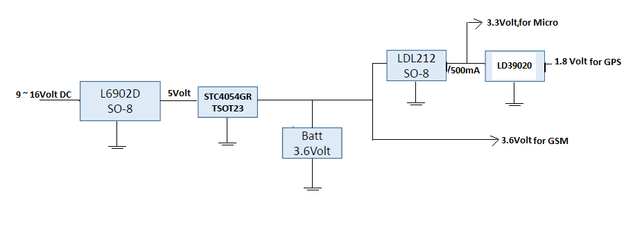

\pagenumbering{arabic} 
\listoffigures

\chapter*{List of Abbreviations}

- **ACIM **: AC Induction Motor
- **AMG **: Analog and MEMS Group
- **ASIC **: Application Specific Integrated Circuit
- **BCM **: Body Control Module
- **BLDC **: Brush-less DC
- **BLE **: Bluetooth Low Energy
- **BSP **: Board Support Packages
- **CAN **: Controller Area Network
- **CMSIS **: Cortex Microcontroller Software Interface Standard
- **ECM **: Electronic Commutation Motor
- **ECU **: Engine Control Unit
- **FOC **: Field-Oriented Control
- **HAL **: Hardware Abstraction Layer
- **IoT **: Internet of Things
- **ISP **: Internet Service Provider
- **LIN **: Local Interconnect Network
- **MITM **: Man-in-the-Middle Attack
- **OOP **: Object-Oriented Programming
- **P2P **: Peer-to-Peer
- **PMSM **: Permanant Magnet Synchronous Motor
- **RSSI **: Received Signal Status Indicator
- **RTOS **: Real-Time Operating System
- **SFR **: Special Function Register
- **SIG **: Specific Interest Group
- **SoC **: System on Chip
- **SWD **: Single Wire Debug
- **TCP **: Transmission Control Protocol
- **UDP **: User Datagram Protocol
- **VLE **: Variable Length Encoding


# Summary

During the internship period at +ST, +grnoida, +in, several projects were done as a part of the AMG^[+AMG] Systems Lab +dept and the Automotive +dept. The AMG +slab, also called the Central Lab, is involved with the design, development and implementation of various proof-of-concept systems revolving around fields like IoT, LED lighting, efficient power supplies, wireless communication systems and various motor control applications. As part of the automotive +dept and AMG Systems Lab, various oppurtunities to work on many realms of the industry, from application software development and firmware development to circuit design and testing were provided. A brief categorisation of the projects is depicted in @fig:proj_categ. A short summary of each project is also mentioned in @sec:proj_sum. 

{#fig:proj_categ}

## Summary of projects {#sec:proj_sum}

A summary of the broad fields and the corresponding projects are as follows

### BLDC ^[+BLDC] and ACIM ^[+ACIM] Drives and Speed Controllers {#sec:bldc_sum}

Electrical motors are one of the most used actutators that can convert electrical energy to mechanical energy. Many other mechanical actuators like the Hydraulic Cylinder is a linear actuator, which has , electrical motors deliver mechanical energy in the form of rotation.

PMSM ^[+PMSM], are synchronous motors that use permanant magnets for magnetic field generation instead of a separate set of windings called the field windings. BLDC motors are a special kind of PMSM, also called the ECM or +ECM. These are called so, because, instead of having a mechanical commutator^[Mechanical commutators are common in electrical machines like the permanant magnet DC motor.], a specifically conditioned signal is provided to the windings directly`. The electronic device which is responsible for the generation of such a conditioned signal, for the BLDC motor is called a *BLDC Motor Drive*.

Following is a brief list about the projects involving BLDC and ACIM motor drives.

- **BLDC Motor Drive on SPC platform** : The project involved testing of a BLDC drive library already implemented by +ST. An exhaustive testing and verification of the firmware library was done.

- **BLDC Motor Drive on STM8 platform**: This involved design and tuning of the motor drive using the six-step commutation algorithm.
  Although, the Motor Drive power stage (MB459) was designed for both low voltage (\<35V) and high voltage(\>35V) operations but the end objective was to drive a high power BLDC motor at 48V. The peak power rating of the motor drive was around 300W. The motor drive features Over current protection, over voltage protection, BEMF sampling, Configurable one or three shunt Current Sensing, Configurable UI and user input options and regenerative braking ability. The Motor Drive controls speed through a PI controller and can perform torque regulation in closed loop operation. 
  
- **ACIM drive on STM32 (STM32F303RE)** : This involved porting of an already implemented firmware from one Hardware Abstraction Layer (STM32-ARM Standard Peripheral Lib) to another (STM32 Cube HAL).


### Automotive Keyless Entry System using BLE

The Keyless Entry System is a security system in automobiles to unlock it without the physical key. The objective of this project was to implement a communication system between a mobile phone app and a BlueNRG1 hardware module to transmit character messages. The BlueNRG1 is a dedicated SoC ^[+SoC] for Bluetooth applications. This project was designed for an automotive application in which the mobile app is used to unlock or lock an automobiles central locking system.


### Vehicle Tracking System

IoT is a fast expanding field for electronics devices. Many technologies and protocols have been developed and rigorously tested to expand the notion of internet onto devices like LED lighting systems, household security and surveillance systems. Technologies such as 6LoWPAN [^6lowpan] are aimed at connecting even the smallest of electronic devices like discrete sensor units and household objects. 
The idea of IoT in household objects is quite interesting. One such application was the use of RFID technology to detect the location of small household objects like keys.
The Vehicle Tracking System is an attempt to bring IoT technology to automobiles. The Vehicle Tracking System involves a hardware module  incorporated in an automobile and a central server system, designed to transmit and store data in the cloud(central server), which can be accessed by the user via an Android app. 
The objective was to design and implement a hardware module. The hardware module comprised of a micro-controller (SPC560D40L1) and a GSM module (Quectel M66). The hardware module uses the GSM communication band to transmit vital automobile statistics to the central server via the TCP/IP data packeting protocol. HTTP was used at the application layer.

[^6lowpan]: **6LowPan** is an +abbr for IPv6 over Low power Wireless Personal Area Networks. It is a technology that was originally intended to extend internet connectivity to smaller low power devices that may not have any dedicated TCP/IP stack.
  Now-a-days, it is used for creating pico-nets or micro-networks of devices, +P2P device communication.

### E-Vehicle Control System (e-rickshaw)

Now-a-days with the decline of non-renewable energy sources, the automotive market has been seeing a shift to hybrid and clean vehicles. These vehicles rely on battery technology and sphisticated high power motors for locomotion. An E-vehicle Control System is a set of hardware and software components that are designed so as to provide a safe and easy way to operate an E-vehicle. E-vehicle here refers to an automobile which relies on electricity for its power needs and does not use any fossil fuels. The E-vehicle system project was made specifically for e-rickshaws, which are gaining popularity in many parts of India. E-rickshaw components in the present market are supplied by Chinese vendors who manufacture unreliable hardware components susceptible to failure and charge a lot of money due to their monopoly in the market. The e-rickshaw project is an attempt to enter this new market with good quality and reliable hardware, which is comparably cheaper than the Chinese counterparts.

The E-vehicle Control System is discussed in @sec:e-rick


# Introduction

## Automotive Electronics

Automotive electronics are electronic systems used in road vehicles, such as: engine management, ignition, radio, carputers, telematics, in-car entertainment systems and others. Electronic systems have become an increasingly large component of the cost of an automobile, from only around 1% of its value in 1950 to around 30% in 2010.

The earliest electronics systems available as factory installations were vacuum tube car radios, starting in the early 1930's. The development of semiconductors after WWII greatly expanded the use of electronics in automobiles, with solid-state diodes making the automotive alternator the standard after about 1960, and the first transistorized ignition systems appearing about 1955.

The availability of microprocessors after about 1974 made another range of automotive applications economically feasible. In 1978 the Cadillac Seville introduced a "trip computer" based on a 6802 microprocessor. Electronically-controlled ignition and fuel injection systems allowed automotive designers to achieve vehicles meeting requirements for fuel economy and lower emissions, while still maintaining high levels of performance and convenience for drivers. Today's automobiles contain a dozen or more processors, in functions such as engine management, transmission control, climate control,antilock braking, passive safety systems, navigation, and other functions.

Modern electric cars rely on power electronics for the main propulsion motor control, as well as managing the battery system. Future autonomous cars will rely on powerful computer systems, an array of sensors, networking, and satellite navigation, all of which will require electronics.

## Battery technology in Automotive Industry

The automotive industry is expanding at a rapid pace. Automobiles are now-a-days more "smarter" and react to environment changes more rapidly. Contrast todays vehicles with the first ever automobiles, which had no logical processing units or sensors. Everything needed to done manually. Today, autmotive industry is highly dependent on the electronics industry for providing efficient systems. This may be called **Automotive Electrification**. With the introduction of high-efficiency high-density LiPo^[LiPo is an abbreviation for Lithium-Polymer ion batteries. These are a variety of battery which uses a polymer electrolyte composed of Li ions instead of a traditional liquid electrolyte. These are extremely light weight and pack a relatively larger amount of energy per volume than other types available.] batteries in the market, the automotive market has taken a turn towards electrification of vehicles. Corporations like Tesla Motors are the pioneers of this technology. With an increase in the production of various kinds of cells and batteries, the market has been flooded with these components. As a consequence, the prices for batteries has dropped sharply in the last decade. This has also impacted the automotive industry, with big companies like Tesla Motors to take the intitiative for making "clean" and pollution-free vehicles. Due to the reduced costs and a foresee-able future of such components, developing countries like +in has also started embracing this technology. Introduction of light battery-powered three and four wheelers on Indian roads is a direct consequence of this trend. 

## Internet of Things

Internet of Things refers to a network of physical objects, like household articles, vehicles, tools, buildings, worn-items, etc. embedded with suitable software and hardware. This software and hardware may enable these objects to communicate with each other or with devices on another network like the Internet. IoT^[+IoT] is also a rapidly growing field. Wireless IoT devices are now-a-days avaialable in any shape or size, starting from smart household appliances like TV, AC, Refrigerators, etc. to small beacons the size of a coin and wearable devices. IoT enabled devices may enable the user to interact with the devices in a number of ways, which include:

- Controlling the device with the help of another device like a mobile phone or a computer.
- Controlling the device with help of HID (Human Interface Device).
- Controlling the device with the help of ones body, using suitable sensors. 
  For example, a smart-watch may be used to turn on an appliance when it detects motion in a certain direction. Sensors such as accelerometers and gyroscopes may be used to detect linear or radial motion.
- Device controlling another appliance.

The uses of IoT are limitless and it is just a matter of time, when the market will be flooded with IoT based devices.

## Combining Automotive Electrification and IoT

With the development of dedicated sensors and low cost IoT devices, it is now possible to efficiently integrate IoT into automobiles. Various kinds of electronic integration is already existent in present automobiles, such as

- **Automotive ECU** : ECU stands for +ECU. It is a logical control system, which takes some input data from the automobiles engine sensors like temperature, acceleration, rate of fuel flow, etc. The ECU is responsible for the efficient combustion of fuel and maintaining the engine conditions well within its operation limits.
- **Body Control Devices** : Body Control Units are responsible for various body control functions of the automobile like central locking system, power windows, various lights like the headlights, tail-lights and indicator lights.
- **Automotive Audio Equipment** : Audio Equipments in automobiles are composed of various electronic devices like audio amplifiers, radio-frequency systems, audio decoders and effects-processors(DSP), low noise amplifiers, speaker systems.
- **CAN Bus** : CAN stands for +CAN. It is a automotive bus specification designed for high speed data transfer. The CAN bus enables several microcontrollers to share data with each other without the presence of a host or central system. It is used for integrating various electronic automotive components like the ECU, Body control unit, sensors, etc. with each other so that they can function in harmony. The CAN bus is discussed in more detail later.


### The need for IoT in automobiles

- Integration of more and more Silicon[^si] into automobiles.
- Smarter and more efficient automobiles.
- Larger economic benefit. Smarter automobiles are more desirable in the current market and hence provide more economic value than its counterparts.

[^si]: Silicon, here refers to electronic logic components. These may refer to logic gates, ASICs, sensors or microcontroller units.


# Software Tools and Hardware Components {#sec:tools}

\begingroup
\fontsize{8}{10}\selectfont

S.No.| Specifications             | Title                | Description                                                                                                 |
----:|:---------------------------------------|:--------------------------------|:-------------------------------------------------------------------------------------|
  1. | Operating Sytem            | Windows 7            | Base OS                                                                                                     |
  2. | IDE                        | IAR Workbench        | IDE for ARM embedded software development                                                                   |
  3. | IDE                        | SPC5Studio           | IDE for SPC embedded software development                                                                   |
  4. | Software                   | UDE Debugger         | A debugger software that supports debugging of microcontrollers with the IEEE compliant JTAG specifications |
  5. | Software                   | STM32CubeMX          | Firmware Code Generator for the STM32 ARM hardware platform devices                                         |
  6. | API and Stack              | BlueNRG-DK           | A comprehensive software development kit for the BlueNRG family of SoCs                                     |
  7. | Programming Language       | C                    | Default language interface for IAR and ppc-gcc-vle compilers used in code production                        | 
  8. | Hardware Device            | STM32 Nucleo         | Evaluation boards for STM32 ARM hardware platform                                                           | 
  9. | Hardware Device            | SPC Discovery        | Evaluation boards for SPC hardware platform                                                                 |
 10. | Hardware Device            | BlueNRG-1            | BLE SOC based on ARM Cortex-M0 core                                                                         |
 11. | Hardware Device            | Telit GL865          | SoC for GSM Communication                                                                                   |
 12. | Hardware Device            | Quectel M66          | SoC for GSM Communication                                                                                   |
 13. | Management Tools           | Git                  | Code Version Management and Repository System                                                               |

: A brief summary of the tools used {#tbl:tool_summary}

\endgroup


## IAR Workbench (also called EWARM, Embedded Workbench for ARM)

IAR Embedded Workbench is the preferred platform for embedded software development at +ST, +in. IAR offers a fast and easy way to write code, compile, upload and flash onto the hardware with minimal effort. It provides an integrated solution for rapid software development. IAR employs its own compiler toolchain for compiling C code to the ARM Cortex-M core based hardware platforms. There are several other IDEs as well like Keil, AC6 Studio, etc. but they do not provide as much streamlined development cycle as IAR does. 

### In-built debugger system

IAR workbench has an in-built debugger system, that supports several hardware specifications like JTAG, J-LINK, STLINK, SWD^[+SWD], SWIM, etc. The debugger supports functions such as

- Breakpoints
- Run or pause execution control
- C-SPY single command execution
- Custom scatter file or linker file configuration
- Live-watch of variables
- Real time view of memory, SFRs and CPU registers
- Injecting values in registers and memory location in real time.

### Language Support

IAR compiler supports both C and C++ as programming languages for embedded software. With the introduction of +OOP concepts in programming, it has become very easy to implement close to real life systems and procedures. Thus, embedded software has also moved a step away from the bare-metal programming^[close to Assembly Language Programming] to more abstract programming. This has been possible due to cheap and highly efficient memory and logic systems. Thus, memory speed and capacity is not a bottleneck, but the speed of development of software is.

## SPC5Studio {#sec:spcstudio}

It is the official IDE for embedded firmware development for the SPC hardware platform (discussed in @sec:spc}. It supports three compiler toolchains:

- FreeGCC compiler toolchain with VLE (GNU)
- Hightec Compiler Collection (Proprietary)
- GHS Compiler Toolchain (Proprietary)

The IDE is based on the Eclipse IDE, a popular open-source IDE for C development. The low level-firmware packages are part of the SPC5Studio itself. The low-level drivers are made in the Freemarker templating language. A GUI interface is provided for manual configuration of the low-level drivers. The configuration can also be done directly to the low-level header files. This kind of configuration is kept persistent using the Patch Architecture of SPC5Studio. It is discussed in @sec:spcstudio_patches.

### Patch architecture {#sec:spcstudio_patches}

The common code for the low-level drivers is embedded in the SPC5Studio itself and included in the project automatically. This is in contrast to other IDEs, where the user has to download the relevant low-level drivers and include them manually in the project. THe advantage of SPC5Studio's method is that, in case of a new version of the low-level drivers is released the IDE will automatically the project according to the new version, while in other IDEs the user has to do so manually. 
If the user wishes to change or edit the low-level driver's code, he/she can do so without having any portabliity issues. This is done using patches. A patch is a piece of arbitrary code that is added on to the base code. The information about each patch is stored in a database file by SPC5Studio and applied to the base code whenever the project is generated.

### Powerful code-completion and management platform

SPC5Studio is built on Eclipse IDE, which is a very popular IDE for Java and C programming. It has borrowed excellent code completion and management features from Eclipse. This enhances productivity and speed of the developer. 

### Pre-built project templates and configuration

To increase the speed of development, several pre-built project templates are already included in the IDE. These project templates contain code for general configuration and operation of each peripheral of the device.

## UDE Debugger Toolkit

{#fig:ude_debug}

Since SPC5Studio does not have any built-in debugging framework or tools, an external toolkit is necessary for operation and debugging. For SPC platform, UDE Debugging toolkit is the standard and default software for debugging. It has built in support for many CPU architectures and several debugging specifications. It also has support for assembly language mixed-breakpoints, i.e. it will show the code in assembly language and the user can run the code one line at a time.

## STM32CubeMX

{#fig:stm32cubemx}

STM32CubeMX is part of the STMCube project by +ST, whose objective is to ease and shorten the development efforts and time. The STM32CubeMX is targeted for the STM32 ARM-based platform. Similar software kit exists for the STM8 and SPC platforms also. In simple words, STM32CubeMX is a initialisation code generator. It provides an easy to use and interactive GUI to configure and generate firmware code for a platform. Its general flow of use is

- Select a suitable microcontroller platform, based on the features and number of peripherals. STM32CubeMX provides a comprehensive database so that the user can easily choose a platform, according to his/her needs.
- Configure which peripherals to use. It automatically disables the clock source for the peripherals selected not to be used.
- Configure the clock frequency to each peripheral by adjusting the clock prescalers for each of them.
- Generate the initialisation code and open it in the IDE of choice.
- Add the application code in the code thus generated.

At this moment, STM32CubeMX supports several IDEs out of the box like IAR, OpenSTM32Studio or AC6, Keil and Atollic TrueStudio.

## BlueNRG-1 DK

It stands for BlueNRG-1 Application Development Kit. It is a set of tools and low-level drivers for the BlueNRG-1 platform. The parts of the Development kit are

- **BlueNRG-1 Flasher** : It is tool for flashing compiled hex code to a BlueNRG-1 device.
- **BlueNRG-1 ST-LINK Utility** : It is a utility software for core level configuration of the BlueNRG-1 platform.
- **Documentation** : A comprehensive set of documentation for using the low-level drivers and APIs for the platform.
- **Example Firmwares** : A few examples that demonstrate typical uses of the Development Kit.
- **C Libraries** : Some C libraries needed by the Development Kit like, peripheral drivers, CMSIS^[+CMSIS], HAL^[+HAL] libraries and BSPs^[+BSP].

## Toolchains

A toolchain is a set of tools and software used to perform complex software development tasks. A toolchain may include compilers and debuggers for a platform and even version control systems. A Version Control System is a tool that allows easy management of code across many versions and changes.

For almost all of the period of internship, the C programming was used. As there were a number of different platforms it was necessary to use a wide variety of toolchains. Some toolchains that were used

- IAR ARM toolchain
- GNU GCC ARM toolchain
- GNU GCC PPC toolchain (with VLE support)
- COSMIC STM8 toolchain

## STM32 Nucleo

The STM32 Nucleo is a family of development boards based on the STM32 microcontroller platform. The STM32 Nucleo come in three variants, the Nucleo-32, Nucleo-64 and Nucleo-144. The boards are categorized on the package of the STM32 integated on the board. Thus the Nucleo-32 has TQFP-32, Nucleo-64 has TQFP-64 and Nucleo-144 has TQFP-144 integrated in them respectively. The STM32 Nucleo boards have morpho connectors which allow them to be easily integrated with Arduino shields. A shield is a stackable board which extends the functionality of the existing system. For example, Sensor shields, Ethernet Shields and Wireless connectivity Shields. The ability to integrate shields in the design results in a much faster prototyping period as the designer does not have to make new designs for the extended functionality. The Nucleo boards contain an on-board debugger, ST-Link. The debugger is cuttable i.e. it can be easily removed by cutting it away. This way the size of the nucleo board can be further minimized.

## SPC Discovery Boards


Similar to the Nucleo boards, Discovery boards provide a fast and reliable platform for prototyping. The boards provide common interfaces like SPI, UART and USB right away and also provide easy integration with debuggers like JTAG. The Discovery boards are manufactured according to the end application, for example a discovery board targetted for motor control applications will provide dedicated 34-pin motor control connectors and dedicated connectors for motor feedback inputs from hall sensors and other sensors. Most Discovery boards also provide an onboard debugger unit. The debugger units are based on two-channel FTDI UART modules, which support the JTAG debugging specifications through a process called bit-banging. Bit-Banging is basically a process of packet transmission by piggybacking it onto a different protocol. So the microcontrollers Debug Control Unit is communicated using the UART protocol. 


## BlueNRG-1 Bluetooth SoC platform [@bluenrg1] {#sec:bluenrg1}

The BlueNRG-1 is a very low power Bluetooth low energy (BLE) single-mode system-on-chip, compliant with Bluetooth specification.
The BlueNRG-1 extends the features of award-winning BlueNRG network processor, enabling the usage of the embedded Cortex M0 for running the user application code.
The BlueNRG-1 includes 160 KB of programming Flash memory, 24 KB of static RAM memory with retention (two 12 KB banks) and SPI, UART, I²C standard communication interface peripherals. It also features multifunction timers, watchdog, RTC and DMA controller.
An ADC is available for interfacing with analog sensors, and for reading the measurement of the integrated battery monitor. A digital filter is available for processing a PDM stream.
The BlueNRG-1 offers the same excellent RF performance of the BlueNRG radio, and the integrated high efficiency DC/DC converter keeps the same ultra-low power characteristics, but the BlueNRG-1 improves the BlueNRG sleep mode current consumption allowing a further increase in the battery lifetime of the applications.

The key features of this network processor are:

- Bluetooth specification compliant master, slave and multiple roles simultaneously, single-mode Bluetooth low energy system-on-chip
- Operating supply voltage: from 1.7 to 3.6 V
- Integrated linear regulator and DC-DC step-down converter
- Operating temperature range: -40 °C to 105 °C
- High performance, ultra-low power Cortex-M0 32-bit based architecture core
- Programmable 160 KB Flash
- 24 KB RAM with retention (two 12 KB banks)
- 1 x UART interface
- 1 x SPI interface
- 2 x I²C interface
- 14 or 15 GPIO
- 2 x multifunction timer
- 10-bit ADC
- Watchdog & RTC
- DMA controller
- PDM stream processor
- 16 or 32 MHz crystal oscillator
- 32 kHz crystal oscillator
- 32 kHz ring oscillator
- Battery voltage monitor and temperature sensor
- Up to \+8 dBm available output power (at antenna connector)
- Excellent RF link budget (up to 96 dB)
- Accurate RSSI to allow power control
- 8.3 mA TX current (@ -2 dBm, 3.0 V)
- Down to 1 µA current consumption with active BLE stack (sleep mode)
- Suitable for building applications compliant with the following radio frequency regulations: ETSI EN 300 328, EN 300 440, FCC CFR47 Part 15, ARIB STD-T66
- Pre-programmed bootloader via UART
- QFN32, WCSP34 package option
- Dedicated wettable flank QFN package for automotive grade qualification

## Telit GL865 and Quectel M66

The Telit GL865 and Quectel M66 are integrated network processor SoCs. These are designed for GSM communication. They support the dual GSM frequency bands. Both of the modules can be easily interfaced to a master device or microcontroller using UART or SPI, but can also function as tandalone network processors. The Telit GL865 features an in-built hardware python interpreter. This interpreter allows it to decode python statements that can be written to the modules flash memory to perform standalone tasks. The M66, on the other hand, is designed as a cheap and rugged SoC with the smallest footprint and size in the industry. Both of the processors are extremely efficient and operate at 1.6V CMOS technology.

## Git Version Control and Management System

Git is a software tool used for version control and management. It essentially keeps track of the changes and additions made in the project files and maintains a history for each of the selected files in a project directory. This helps the programmer to quickly revert back to a working version if an addition to the code breaks its functionality or to develop new features in complete isolation to the main branch, so that they don't break the main branch ir something goes wrong. Git is also an extremely useful tool for team coordination and collaboration. A central source code repository can be maintained, and a large team can contribute to the repository by "pushing" their code to this central repository. 


# Vehicle Tracking System (VTS)

## Introduction

The product is a smart solution for keeping track of a vehicles location and its vital statistics. The Vehicle Tracking System is an integrated solution with built-in GSM and GPS functionality for data acquisition and connectivity. 

## Existing Solution(s) (Hardware and Software)

A fair number of such solutions already exist in the market. One of the solutions that was analyzed was based on a MediaTek controller unit (ARM core) with ublox GPS and SIM-900 GSM modules. A piezo-electric MEMS sensor IC, ADXL345 was also integrated to collect velocity and acceleration data. The problem with this very implementation that it is not composed of automotive grade components. Automotive grade components are designed to be more rugged and temparature resistent. As no automotive grade components were used in the analyzed design, it is more susceptible to failure. The design was made to be as cheap as possible, so a lot of components were used after lots of cost-cutting.

## Objectives

After a preleminary analysis of the given product, a set objectives were formulated. The primary objective was to design and implement a Vehicle Tracking solution which is rugged enough to meet automotive needs and can be used with minimal human intervention. Additionaly, the following objectives were laid out.

- To showcase the abilities of the Teseo III range of geolocation devices, developed at ST. Teseo is a family of ASICs developed primarily for geolocation, and has several peripherals like SPI, UART, in-built flash, etc. The Teseo range has had three iterations over the years and the latest iteration supports geolocation protocols such as NMEA, GNSS, GPS, Galileo, Beidou, etc. It is a moderately priced highly powerful system, designed for automotive applications in mind.
- To use the SPC series of microcontrollers. The SPC series is based on the e200hz core which is based on the Power Architecture. It is based on the Book-E specification for PowerPC which defines some specifications for embedded applications. More details about the SPC platform is given at @sec:spc.
- The solution should collect the following vehicle statistics:
    - Longitude
    - Lattitude
    - Speed
    - GSM and GPS RSSI^[+RSSI]
    - Engine Ignition status
    - Central Locking status
    - Air-Conditioner status
    - Timestamp of data acquisition
- The solution should send the acquired data using GPRS through TCP transport layer or using HTTP GET in the application layer.

## Project Details

The hardware and software sections of the project were taken care of separately. Following are the details of the hardware and software implementations of the project.

### System Model

The system follows a client-server model. A flow diagram of the general system model is shown in @fig:vts_model. As shown in the figure the system consists of the following key components.

- Central Server
- NodeJS
- Database Backend Server
- Internet Gateway (ISP)
- GSM Mobile Tower (GSM antenna)
- GSM communication link
- VTS equipped vehicles

{#fig:vts_model}

A brief explanation of each component is as follows:

1. Central Server
    
    The Central Server is responsible for maintaining connectivity to each of the individual VTS-equipped vehicles and receive the geolocation and vehicle data. The communication is done either via the TCP protocol in transport layer or via HTTP protocol in the application layer of the TCP/IP stack. 

    - Using TCP protocol
        
        Communication using TCP protocol needs an open socket or port at the server end. As soon as the authentication handshake is complete between the client and the server, the client can transmit and receive data from the server. The created link is full duplex i.e. it supports simultaneous transmission and reception at both ends. The TCP protocol is fairly reliable and robust on its own, but to increase its robustness, several error-checking mechanisms were used in the application layer of the VTS firmware.

    - Using HTTP protocol
        
        Communication using HTTP protocol uses the underlying TCP layer but the commuincation link itself is not full duplex. The server on its own cannot initiate transmission on its end to the client. The server can only send data after the client has connected and transmitted some data. This is a drawback in HTTP protocol, that there is no always-alive link as there was in TCP. Thus the client has to repeatedly establish and break its connection whenever it wants to send some data. This drawback may be overcome by using dedicated HTTP server software, but it leads to complexity in the server end. The GET technique was used during HTTP communication in which the payload (data) from the client is sent after appending it in the server URL. There is a maximum limit in the amount of data that can be sent at a time, which was 2MB for our particular hardware. There is no such limit in TCP protocol.

2. NodeJS
    
    NodeJS was the preferred server-side programming language due to its speed and fexibility. Several APIs were avaialable in NodeJS that facilitated and reduced the server-side development time.

3. Database Backend Server
    
    This is the backend server responsible for managing the database of all the tracked data. A database application known as MongoDB was used for this purpose. MongoDB is known for being light-weight and readiliy integrable with NodeJS. This database can further be queried from an android application that can display the information at the user-end.

4. Internet Gateway
    
    The Internet Gateway is responsible for routing the data packets from the VTS to the central server. The gateway is managed by ISPs^[+ISP]. A dedicated channel was secured with Airtel, for testing purposes.

5. GSM Communication link
    
    The GSM communication link is managed between the GSM base station of a particular cell and the GSM module in the VTS. The data communication is done through GPRS (General Radio Packeting Service). 

### Hardware

{#fig:vts_block_diagram}

#### The SPC series of microcontrollers {#sec:spc}

The SPC series of microcontrollers is based on the Power Architecture Book E specification, developed by Freescale (now NXP) and Motorola. The Book E specification is designed for embedded applications of low to medium range processing needs. The SPC series was formarly called the MPC series and was being developed at NXP. A deal was struck between NXP and ST, wherein both parties agreed to develop the MPC series further to use it in the automotive domain. Thus, NXP provided their hardware and ST developed the low-level peripheral drivers required to write software for this device. The low-level peripheral drivers are now a part of the SPC5Studio suite, previously discussed in @sec:spcstudio. 

The low-level peripheral drivers have also seen a few iterations. The first iteration was called the **HAL**, or the *Hardware Abstraction Layer*. It used a set of C functions to interact with the peripheral hardware. As it turned out, it was not scalable and could not be ported to the large range of SPC microcontrollers that were made. So a newer and scalable iteration was made, which was called the **RLA**, or the *Register Level Access* layer. Instead of using functions, the RLA uses C unions and structs to map the peripheral registers and some higher level functions to interact with them. This way only the union and structs needed to be varied for each hardware, while the higher level functions could be reused. Thus RLA, is the preferred and supported driver for SPC and was used in the project.

#### Power Supply section

The device was designed to take its power supply from the automobiles +12V power rail directly. Additionally a large number of onboard components require different voltages for their functioning, like the GPS module runs on \+1.8V while the GSM module runs on \+3.3V. So several voltage regulators were used. 

In scenarios like theft, the thief removes the car battery so as to not trigger off any alarms. The device was designed to function in such a case also. For this an onboard power supply from a Lithium polymer battery was used.

A block diagram of the power suppy section of the device is shown in @fig:vts_power_supply.

{#fig:vts_power_supply}

**Device Description**

* **L6902D**

    The input section is composed of L6902D. This is a low-voltage LDO (Low Dropout voltage regulator). The input to this IC is from the automobiles power supply rail of \+12V. A safe margin of \+9V to \+16V has been assumed. This device gives an output of \+5V.

* **STC4054GR**

    The \+5V output is then given to the input of a Battery Management IC, STC4054GR. This IC produces a regulated current flow for safe charging of the Lithium Polymer battery. The output voltage varies from \+3.6V to \+4.5V DC, according to the charging region the battery is currently in. The Li-Po battery used is of 3.6V rating. For testing purposes an 80mAh battery was used, although the final design was made with a battery of much higher capacity in mind. 

    The \+3.6V nominal output of the battery was given to the GSM module, as it required a voltage of \+3.3V to \+4.2V for proper functioning. Also, the GSM module needs current upto 2A, and the PCB tracks were designed according to this.

* **LDL212**

    The \+3.6V output of the battery is not suitable for devices functioning at \+3.3V, thus a voltage regulator was introduced in the chain. The LDL212 produces regulated \+3.3V to supply for microcontroller. The LDL212 has a current limitation of 500mA, which was well within the requirement of the microcontroller and the GPS module.

* **LD39020**

    Further a \+1.8V supply was required for the GPS module. The LD39020 is a fixed-mode voltage regulator used for this purpose.

#### Device Integration

The project features a number of co-dependent devices. The microcontroller is the central entity in the system, while all the other devices follow and obey the commands the are sent by the microcontroller. The devices need a medium to communicate with the controller. This is done using communication busses. There are several kinds of bus technologies like the SPI, I2C, CAN, etc. In this project two kinds of bus technologies are used.

1. **UART or LIN bus**

    **UART** stands for *Universal Asynchrnous Receiver and Transmitter*. It is a protocol for serial data communication and uses two physical wires, one for data transmission and one for reception. The UART protocol is widely used due to its availablity and simplicity. The UART protocol sends data in the form of byte-sized packets that have a starting and a stop bit. The packet may contain 7-bits or 8-bits of data. Thus for textual data, one character is sent at a time. The simplicity of UART lies in the fact that very minimal physical level hardware is required. As the communication mode is asynchronous, no clock synchronisation is required. The two communicating devices just have to know the signal rate at which transmission is occurring, beforehand. This is called the baud rate and is measured in bps (*bits per second*). A wide range of baud rates are supported by the SPC microcontrollers UART peripheral, which means the baud rate can be set to any integral number which is a multiple of the peripherals prescaled clock frequency. 

    In this project UART is being used for communication with the GSM and GPS module. A buad rate of 115200 bps was used for communication with both the devices. 

    The UART peripheral on the SPC microcontroller is derived from the **LIN^[+LIN] bus**, which is closely related to UART and used in automotive systems. The LIN bus is a low reliability and low speed communication system which is used in the automobile to transmit low priority data like body control systems, window control systems, headlight monitoring systems, etc. More details about LIN are discussed in @tbl:lin_can_comparison.

    The UART peripheral on the SPC microcontroller follows an interrupt model for its functioning. It has its own FIFO buffer for data storage, thus it needs to first fill this buffer and then transmit it. At the successful transmission of each character, an interrupt is generated and in the ISR, the FIFO pointer is incremented one step. This process continues until all the data in the FIFO buffer has been sent or no new data has been added in the FIFO buffer.


2. **CAN bus**

    The CAN bus stands for *Controller Area Network*. It is a differential bus, multi-master protocol, which is designed for highspeed data communication, generally in automotive systems. A CAN bus is multi-mmaster, which means that it can support more than two communicating devices simultaneously. A CAN bus is composed of two components:

    * **The CAN peripheral**

        {#fig:can_spc_config}

        The CAN peripheral is the integrated peripheral present inside the microcontroller system, which encodes the data to digital signals. The NRZ protocol is most widely used for this. The CAN bus is also a serial data protocol so only two physical wires are needed. The CAN peripheral outputs the digital signals via two GPIOs named the **CAN_rx** and **CAN_tx**, for reception and transmission, respectively. The CAN protocol is also asynchronous in nature, so no clock synchronisation is necessary. The signal rate or the bit rate of transmission is pre-negotiated between the devices. The signal is received by sub-sampling the received waveform, at a frequency of **f~tq~**, where **f~tq~ = bit_rate \* number_of_time_quanta**. The bit rate and the number of time quanta are pre-nnegotiated within the devices. 

        The multi-master approach of the CAN bus allows it to have a large number of devices connected and transmitting data simultaneously. This is done by using a data identifier with each set of transmitted data. There are two kinds of IDs, a Standad ID which is 11 bits in length and an extended ID is 29 bits long. The CAN peripheral has an ID mask, which will only allow messages of certain IDs to pass through.

    * **The CAN physical layer**

        {#fig:can_bus_phy}
      
        The CAN physical layer is composed of an interface IC, the actual physical layer link and two terminating resisters. For this project, a CAN physical layer IC named, L9616 was used. A block diagram is shown in @fig:can_bus_phy,


        CAN physical layer is composed of two wires called the **CAN_HI** and **CAN_LOW**. CAN_HI wire achieves a higher potential than CAN_LOW when a dominant bit (0) is to be transmitted, and both CAN_HI and CAN_LOW achieve a floating potential when a recessive bit (1) is to be transmitted. The difference between the higher potential of CAN_HI and lower potential of CAN_LOW is nominally +1V. Thus the receiver samples the potential difference between the CAN_HI and CAN_LOW wires to detect if recessive or dominant bit is being transmitted. The advantage of such a system is that no GND wire is required between the systems. Each system may have different operating voltage, they only have to maintiain the nominal differential voltage between CAN_HI and CAN_LOW.

        The CAN bus wires are generally terminated with two terminating resistors on both ends as shown in the @fig:can_bus_phy. The value of each terminating resistor is generally 120 ohms. The terminating resistors provide an impedence matching for the system. Thus value of the terminating resisters is chosen to match the characteristic impedence of the CAN transmission line. For small bus systems the terminating resistors may not be required, but practically a CAN bus may range to several meters in length (inside a vehicle) and the impedence matching play a role in proper data transmission.


S.No.| +LIN             | +CAN               |
--:|:-----------------------------|:-----------------------------|
  1. | LIN is a low-speed system | CAN is a high reliablity and high-speed system |
  2. | LIN is closely related to the UART protocol | CAN is not related to the UART protocol |
  3. | LIN has a typical bandwidth of 20kBps for a bus length of 40m | CAN specidfication ensures a bandwidth of 125kBps for a bus length of upto 40m. |
  4. | LIN is a master-slave protocol, with one master and as many as 15 slaves | CAN is a multi-master protocol |
  5. | LIN does not ensure fault-tolerant data transmission on its own | CAN ensures fault-tolerancy in data transmission |
  6. | LIN is not a full replacement of the CAN bus. But the LIN bus is a good alternative wherever low costs are essential and speed/bandwidth is not important. Typically, it is used within sub-systems that are not critical to vehicle performance or safety | CAN bus is preferred for safety critical applications in automobiles like ECU communication and interacting with the braking system |

: Comparison between LIN and CAN bus systems {#tbl:lin_can_comparison}

#### Serial Flash Device {#sec:sflash}

A Flash memory device was also integrated into the system. The flash memory device is used to store acquired data when it can not be sent to the central server. The device used was M25P16 which is a 16 megabit flash memory with a clock frequency of 75MHz. It is interfaced using SPI bus protocol. The device follows master-slave architecture where the microcontroller is the master and the flash memory is the slave. The flash memory device receives specific commands, for example data write or read at address, and it responds with the appropriate data.

### Software 

The firmware for the device is written for the SPC series of microcontrollers, but is fairly portable to other systems as well. While writing the firmware the following points were kept in mind:

- The firmware should be able to perform several tasks in real time. The system needs to track the GPS coordinates in real time as well as communicate to the GSM network and monitor the vitals of the vehicle. The tasks should not interfere with each other.
- The firmware should be as compact as possible. Although, the SPC microcontrollers used had an abundant amount of flash memory available for code storage, it was decided to keep the size as low as possible so that it could be ported to other cheaper systems with lower amount of memory.
- The firmware should be easy to understand and debug.

#### Available options and trade-offs

- For keeping the code easily understandable and debuggable, the structure of the code was chosen in the form of a Finite State Machine. Several states based, on the functioning of the system were selected, such as
    - Reset State
    - Init State
    - Idle State
    - Data Acquire State
    - GSM Send State
    - Wait State
  
    An explanation and description of each state is given in @sec:states. The advantage of this architecture is that the current state is easily visible in the UDE Debugger. Thus, a real time monitoring of the system can be done.

- For keeping the code asynchronous or non-blocking, one option was to use an **RTOS**. RTOS stands for Real-time Operating System. It is an operating system for embedded systems. It supports pre-emptive multi-tasking, which means that every process is run for a certain amount of time, not necessarily to its completion and a context-switch is made. A context-switch refers to the saving of current contents of stack, CPU registers and the program counter to a memory location and fill them with the contents of a new process. In this way a periodic context switch is made by the RTOS and a number of processes can run simultaneously. The latency is a measure of the delay the RTOS introduces as an overhead in this process. On an average CPU with a 16 MHz clock frequency, FreeRTOS, an implementation of RTOS, introduces a maximum latency of about 7ms.

    The RTOS is an extremely efficient solution to this problem but it comes at a cost. An implementation of RTOS known as **ChibiOS** is available and well supported on the SPC platform but even a minimal integration of ChibiOS takes about 50kB of flash memory which is way too much for some smaller cost-efficient systems.

    Thus a non-blocking architecture based on *co-operative preemption* was employed. So, instead of employing a separate RTOS, the firmware was written in such a way that it mimics the behaviour of RTOS. This in-turn introduced a larger latency that RTOS but it was cost-efficient and the whole code was compiled to a size of just 29kB.

    The non-blocking architecture is discussed in @sec:non_blocking_arch


#### Non-Blocking State Architecture {#sec:non_blocking_arch}

As one of the requirements of the system was to perform several tasks in parallel, the state machine alone can't take up all the CPU time. An example of this scenario is evident with the *Input Sensing* functionality of the system. According to this functionality the vital statistics of the vehicle like Door Central Locking status, Air Conditioner status, Engine Ignition status and Battery Power status can be accessed by tapping into the Electronic Control Unit of the vehicle and routing it to the GPIO pins of the microcontroller. In this way, no new hardware will be required to sense the vital statistics. 

As GSM communication and acquiring geolocation data from GPS satellites is a time-consuming task for the system. In a blocking architecture it may take a relatively large amount of time for the system to wait for these tasks. Inherently in a blocking architecture, the system will have to halt all of its processes and wait for completion of the task at hand. Such an architecture is not feasible to be used in this case. This may result in over looking of input data. For example, the system takes 10 seconds to establish a GSM connection to the nearest cell tower and register itself, the system will have to halt for those 10 seconds, so any change in the vehicle vital statistics will go unnoticed. 

To counter this scenario, the firmware was designed to be non-blocking in nature. This is evident from the main function of the firmware.

```C
int main(void) {
  while(1){
    state_machine_exec();
    gps_state_machine();
    input_sense();
  }
}
```

Thus inside the main while loop, three *re-entrant* functions are present, ```state_machine_exec()```, ```gps_state_machine()``` and ```input_sense()```. Re-entrant functions are desinged such that they are able to remember their progress and resume the process when called again. Thus, each function in the main while loop is designed such that it executes partially, remembers its progress and exits, thus transferring the control to the next function. The next function similarly executes in this form and the ```while``` loop takes care that each function runs periodically.


#### The Finite State Machine {#sec:states}

A flow diagram of the state machine is provided in the @fig:fsm_flow.

{#fig:fsm_flow}

The FSM has been implemented in C using switch-case statements, as follows

```C
  static state_return_t ret;

  switch (current_state) {

  case RESET:
    ret = state_reset();
    if (ret==SUCCESS) {
      next_state = INIT;
    } else if (ret==STATE_REMAIN) {

    } else {
      next_state = INIT;
    }
    break;

  case INIT:
    ret = state_init();
    if (ret==SUCCESS) {
      next_state = IDLE;
    } else if (ret==STATE_REMAIN) {

    } else {
      next_state = IDLE;
    }
    break;

  case IDLE:
    ret = state_idle();
    if (ret==SUCCESS) {
      next_state = DATA_ACQUIRE;
    } else if (ret==STATE_REMAIN) {

    } else {
      next_state = DATA_ACQUIRE;
    }
    break;

  case DATA_ACQUIRE:
    ret = state_data_acquire();
    if (ret==GSM_SIGNAL_GOOD) {
      next_state = GSM_SEND;
    } else if (ret==GSM_SIGNAL_BAD) {
      next_state = STANDBY;
    } else if (ret==STATE_REMAIN) {

    } else {
      next_state = GSM_SEND;
    }
    break;

  case GSM_SEND:
    ret = state_gsm_send();
    if (ret==SUCCESS) {
      next_state = WAIT;
    } else if (ret==STATE_REMAIN) {

    } else {
      next_state = WAIT;
    }
    break;

  case STANDBY:
    ret = state_standby();
    if (ret==GSM_SIGNAL_GOOD) {
      next_state = GSM_SEND;
    } else if (ret==GSM_SIGNAL_BAD) {
      next_state = WAIT;
    } else if (ret==STATE_REMAIN) {

    } else {
      next_state = GSM_SEND;
    }
    break;

  case WAIT:
    ret = state_wait();
    if (ret==GPS_SIGNAL_GOOD) {
      next_state = DATA_ACQUIRE;
    } else if (ret==GPS_SIGNAL_BAD) {
      next_state = WAIT;
    } else if (ret==WAIT_TIME_NOT_OVER) {
      next_state = WAIT;
    } else if (ret==STATE_REMAIN) {

    } else {
      next_state = DATA_ACQUIRE;
    }
    break;

  case FAULT_STATE:
    ret = state_fault();
    if (ret==GOOD) {
      next_state = IDLE;
    } else if (ret==STATE_REMAIN) {

    } else {
      next_state = IDLE;
    }
    break;

  default:
    next_state = FAULT_STATE;

  }
```

As evident from the code snippet above, each state has been encapsulated inside a function of appropriate name, for example ```state_reset()```, ```state_init()``` and ```state_idle()```.

An example of such a state function ```state_idle()``` is given below as a code snippet.

```C
/**
 * @brief Idle state function
 *
 * Entry point to the state machine loop.
 * Default entry point after recovery from fault.
 * Wait for both GPS and GSM module to acquire
 * a good signal strength.
 *
 * @return state_return_t
 */
state_return_t state_idle() {

    state_return_t ret;

  /* Check GSM module SIM registration status */
  if (state_idle_status_var == STATE_IDLE_ENTRY) {
    /* wait for SIM registration */
    _SM_WRAPPER(is_sim_regsitered(NON_BLOCKING), SIM_REGISTRATION_FAIL);
    state_idle_status_var = SIM_REGISTERED;
  }

  if (state_idle_status_var == SIM_REGISTERED) {
    /* enable GPRS */
    _SM_WRAPPER(enable_GPRS(NON_BLOCKING), GPRS_ENABLE_FAULT);
    state_init_status_var = GPRS_EN_DONE;
  }

  return GOOD;
}
```

##### Description of the states

1. Reset State 

    The reset state is the application entry-point. It is the first state that should be executed as all low-level peripheral drivers and IRQ handlers are initialized in this state only. The exit point from this state points to the ```INIT``` state.

2. Init State

    The init state is meant for various initialisation tasks.  The UART (LinFLEX) peripheral is initialized and various GSM module related operations are done to ensure that it is correctly turned on and functioning. After successful initialisation the control moves to idle state.

3. Idle State

    The Idle state is the entry point to the state machine loop (see @fig:fsm_flow). It is also the default entry point after recovery from any fault. In the idle state the system waits for both GPS and GSM modules to acquire a good and stable signal strength for reliable communication. If the GPS and GSM mofules acquire a good signal, the control moves to the GPS Acquire State.

4. GPS Acquire State

    This is the data acquisition state. The geolocation data and other data like acceleration and velocity are acquired using the GPS module. The communication between the GPS module and microcontroller is done using a standard set of commands called the NMEA commands. The data acquired in this state is serialised and put in a central buffer for further processing. After this process, a check is done with the GSM module, if its signal is still above a threshold level and that it can reliably transmit or receive data. If it is able to, the control moves to the ```GSM Send``` state. Else it moves to the ```Standby``` state.

5. GSM Send State

    This is the state where the acquired data is sent to the central server via GSM network. TCP is used in the transport layer. The system opens a socket on a dedicated port on the central server and sends the serialised data as a stream. The central server interprets the source system of data using a unique ID, called the *Vehicle ID*. Each installed system is assigned a unique vehicle ID derived from the IMEI number of the GSM equipment. 

6. Standby State
    
    The Standby state is entered if the GSM module loses its connection in between the process. In such a state the system cannot send the statistics to the central server as the connection has been hindered. So, as to not incur a loss of data, it is stored in an external flash memory device. The flash memory device has been discussed in detail in @sec:sflash. The data is stored in LIFO order, so that the data most recently stored is sent out the very first time, a relaible GSM conenction is made again. This is to ensure that the ccentral server gets the newest set of data first. A check with the GSM module is made again at the end of this state, if the signal is above a threshold the control moves to ```GSM Send``` state, else it moves to the ```Wait``` state.

7. Wait State
    
    The Wait state is used to introduce a delay in between each cycle of data acquisition and transmission. This is done to

    - **Reduce the duty cycle of the system**
        
        Reducing the duty cycle reesults in a reduction in power consumption of the system, as it will be functioning for a lesser duration. The delay duration is strategicaly set to balance efficiency and power consumption. The waiting period was earlier set to 5 secondds. Later an algorithm was devised to set the waiting period dynamically with changing battery voltage, so that when battery power is running low, the system inhibits its duty cycle.

    - **Reduce Central Server traffic**
    
        The central server is responsible to receiving the data and ensure that it is stored in the database properly. For this purpose, the central server has to maintain a live TCP stream link with every online vehicle tracking system. For a large number of such online systems, the central server would be easily overwhelmed, if every system was sending data continuosly. Thus, to keep incoming traffic low, the vehicle tracking systems will only send data after a periodic interval.

### Testing and Result

An Android app was developed as an user interface to the system. It queries the data collected at the server according to the date and time at which it was recorded. The prototype device was attached to a testing vehicle and the vehicle followed a well known path in the city, while the Vehicle Tracking System was engaged. The following figure @fig:vts_demo shows the various recorded statistics and the path of the vehicle on a map.

{#fig:vts_demo}


# Automotive BLE Keyless Entry System


## Introduction

Automotive security is a very important aspect in the Automotive Industry. An large budget in automotive development is solely dedicated towards security and reliablity. Several anti-theft systems are present in the market.Considering the growing popularity for IoT and the emergence of very low power radio devices, it is a matter of time that market will be flooded with applications of such devices. The BLE Keyless Entry System is an attempt to merge IoT with Automotive Security.

## Problem Statement

The problem is to devise a central locking system which can be operated via a BLE^[+BLE] enabled device. Most of the smartphones available in the market today support one or the other forms of Bluetooth. Thus, a smartphone should be able to operate this central locking system. 

## Current Solutions

Several kinds of wireless central locking systems are available in the market, but most of them are operable through proprietary hardware from a few vendors. All of them operate in the 2.4 GHz radio frequency range. 

The solutions comprised of a key-fob, or a remote with a few buttons, to unlock and lock the car. A few of them had a feature of locating the car via sound and light so that the user may find his/her car easily in a parking lot. A key-fob is shown in @fig:key_fob.

{#fig:key_fob}

### Merits of the current solutions

All the current solutions were using proprietary protocols designed by the specific vendors. While this reduces the portability of the application and introduces many, at times conflicting, standards in tha market, on the other hand, this also obscures its working. This increases the sceurity of the system. A person who does not know how the system works will have a very difficult time figuring out how to break it. The 2.4 GHz radio frequency range is a widely used spectrum for wireless applications, and due to its popularity, the radio hardware for this spectrum is also very cheap.

### Demerits of the current solutions

- Due to proprietary hardware and software no standard is present for this application. There is a large variation in the functionality and the security of the systems.
- The systems are susceptible to a number of security flaws, like

    - Injection attacks
        
        A 3rd party key-fob can be tampered and made to mimic other key-fobs. This way, any vehicle can be unlocked using a single master key.

    - Replay attacks
        
        A specialised radio-transciever can be made that can record RF communication packets when a legitimate key-fob is operated. After some time, this transciever can be used to emit the same sequence of packets in the same RF range, and the central locking system mistakes it for the legitimate key and unlocks.

    - Man-in-the-middle attacks

        A specialised radio-transciever is used that acts a repeater for RF signals. Many key-fobs continuosly emit their handshake keys, and when the key-fob is in range of the vehicle it can unlock. The transcievers can act as transparent signal boosters and unlock the vehicle even if the key-fob is very far away.

- A separate key-fob is required for operating the system. Although, this increases the security of the system, but if the key-fob gets lost, the whole system is compromised.

### Objectives

- To implement a system using the BlueNRG-1 SoC platform for central locking.
- An android application should be able to scan the vehicle from a distane of atleast 30ft, connect to it and unlock it.
- The connection establishment time should be kept as minimum as possible, in the order of a few hundred milliseconds.
- The system should be interfaceable with any vehicles Body Control Unit.
- An additional feature known as flasher is to be implemented, which will flash some lights on the vehicle to help the user to find it.

## Project Details

### Bluetooth Low Energy Protocol (BLE) [@bluetooth]

The Bluetooth Low Energy protocol is an extension of the Bluetooth Classic protocol. It has been developed and marketted by the Bluetooth SIG^[+SIG], which comprises of many corporations that oversea the development of Bluetooth specifications.

Compared to Classic Bluetooth, BLE is intended to provide considerably reduced power consumption and cost while maintaining a similar communication range. BLE was originally introduced under the name *Wibree* by Nokia in 2006. It was merged into the main Bluetooth standard in 2010 with the adoption of the Bluetooth Core Specification Version 4.0. Mobile operating systems including iOS, Android, Windows Phone and BlackBerry, as well as macOS, Linux, Windows 8 and Windows 10, natively support BLE. The Bluetooth SIG predicts that by 2018 more than 90 percent of Bluetooth-enabled smartphones will support BLE.

Borrowing from the original Bluetooth specification, the Bluetooth SIG defines several profiles — specifications for how a device works in a particular application — for low energy devices. Manufacturers are expected to implement the appropriate specifications for their device in order to ensure compatibility. A device may contain implementations of multiple profiles.

All current low energy application profiles are based on the generic attribute profile (GATT), a general specification for sending and receiving short pieces of data known as attributes over a low energy link. Bluetooth 4.0 provides low power consumption with higher bit rates.

Some well known profiles that are found in common applications are as follows

1. **Health care profiles**

    There are many profiles for BLE devices in healthcare applications. The Continua Health Alliance consortium promotes these in cooperation with the Bluetooth SIG.

    - BLP (Blood Pressure Profile) — for blood pressure measurement.
    - HTP (Health Thermometer Profile) — for medical temperature measurement devices.
    - GLP (Glucose Profile) — for blood glucose monitors.
    - CGMP (Continuous Glucose Monitor Profile) Sports and fitness profiles
    
2. **Profiles for sporting and fitness accessories**

    - BCS (Body Composition Service)
    - CSCP (Cycling Speed and Cadence Profile) — for sensors attached to a bicycle or exercise bike to measure cadence and wheel speed.
    - CPP (Cycling Power Profile)
    - HRP (Heart Rate Profile) — for devices which measure heart rate
    - LNP (Location and Navigation Profile)
    - RSCP (Running Speed and Cadence Profile)
    - WSP (Weight Scale Profile)

3. **Internet Connectivity**

    - IPSP (Internet Protocol Support Profile)

4. **Generic Sensors**

    - ESP (Environmental Sensing Profile)
    - UDS (User Data Service)

5. **HID Connectivity**

    - HOGP (HID over GATT Profile)

6. **Proximity sensing**

    "Electronic leash" applications are well suited to the long battery life possible for 'always-on' devices. Manufacturers of iBeacon devices implement the appropriate specifications for their device to make use of proximity sensing capabilities supported by Apple Inc. compatible iDevices.

7. **Relevant application profiles**

    - FMP — the "find me" profile — allows one device to issue an alert on a second misplaced device.
    - PXP — the proximity profile — allows a proximity monitor to detect whether a proximity reporter is within a close range. Physical proximity can be estimated using the radio receiver's RSSI value, although this does not have absolute calibration of distances. Typically, an alarm may be sounded when the distance between the devices exceeds a set threshold.
    
8. **Alerts and time profiles**

    - The phone alert status profile and alert notification profile allow a client device to receive notifications such as incoming call alerts from another device.
    - The time profile allows current time and time zone information on a client device to be set from a server device, such as between a wristwatch and a mobile phone's network time.

9. **Battery**

    - The Battery Service exposes the Battery State and Battery Level of a single battery or set of batteries in a device.

#### Advertising and discovery

BLE devices are detected through a process based on broadcast advertising packets. This is done using 3 separate channels (frequencies), in order to avoid interference. Both the advertising devices, and the scanners looking for those devices, step through the three channels in sequence. This means that on average, there is only about a 1 in 9 chance of a scanner detecting a particular device's advertisement; in practice it is significantly lower than this. In turn this causes the time to discover devices to be both highly variable and on average, much longer than the frequency the devices transmit at.

#### Software model

All BLE devices use the Generic Attribute Profile (GATT). The application programming interface offered by a Bluetooth Smart aware operating system will typically be based around GATT concepts. GATT has the following terminology:

- **Client**

    A device that initiates GATT commands and requests, and accepts responses, for example, a computer or smartphone.

- **Server**

    A device that receives GATT commands and requests, and returns responses, for example, a temperature sensor.

- **Characteristic**

    A data value transferred between client and server, for example, the current battery voltage.

- **Service**

    A collection of related characteristics, which operate together to perform a particular function. For instance, the Health Thermometer service includes characteristics for a temperature measurement value, and a time interval between measurements.

- **Descriptor**

    A descriptor provides additional information about a characteristic. For instance, a temperature value characteristic may have an indication of its units (e.g. Celsius), and the maximum and minimum values which the sensor can measure. Descriptors are optional – each characteristic can have any number of descriptors.

    Some service and characteristic values are used for administrative purposes – for instance, the model name and serial number can be read as standard characteristics within the Generic Access service. Services may also include other services as sub-functions; the main functions of the device are so-called primary services, and the auxiliary functions they refer to are secondary services.

#### Identifiers

Services, characteristics, and descriptors are collectively referred to as attributes, and identified by UUIDs. Any implementer may pick a random or pseudorandom UUID for proprietary uses, but the Bluetooth SIG have reserved a range of UUIDs (of the form ```xxxxxxxx-0000-1000-8000-00805F9B34FB```) for standard attributes. For efficiency, these identifiers are represented as 16-bit or 32-bit values in the protocol, rather than the 128 bits required for a full UUID. For example, the Device Information service has the short code ```0x180A```, rather than ```0000180A-0000-1000-...``` . The full list is kept in the Bluetooth Assigned Numbers document online.

#### GATT Operations

The GATT protocol provides a number of commands for the client to discover information about the server. These include:

- Discover UUIDs for all primary services
- Find a service with a given UUID
- Find secondary services for a given primary service
- Discover all characteristics for a given service
- Find characteristics matching a given UUID
- Read all descriptors for a particular characteristic
- Commands are also provided to read (data transfer from server to client) and write (from client to server) the values of characteristics:

A value may be read either by specifying the characteristic's UUID, or by a handle value (which is returned by the information discovery commands above).
Write operations always identify the characteristic by handle, but have a choice of whether or not a response from the server is required.
'Long read' and 'Long write' operations can be used when the length of the characteristic's data exceeds the MTU of the radio link.
Finally, GATT offers notifications and indications. The client may request a notification for a particular characteristic from the server. The server can then send the value to the client whenever it becomes available. For instance, a temperature sensor server may notify its client every time it takes a measurement. This avoids the need for the client to poll the server, which would require the server's radio circuitry to be constantly operational.

An indication is similar to a notification, except that it requires a response from the client, as confirmation that it has received the message.

There is a significant difference between Bluetooth Classic and BLE. The key points are enumaerated in the @tbl:ble_diff.

| Technical specification | Classic Bluetooth technology | Bluetooth Smart technology (BLE) |
|:-----------------------|:-----------------------------|:-----------------------------|
| Distance/range | (theoretical max.) 100 m (330 ft) | >100 m (>330 ft) |
| Over the air data rate | 1–3 Mbit/s | 125 kbit/s – 1 Mbit/s – 2 Mbit/s |
| Application throughput | 0.7–2.1 Mbit/s | 0.27 Mbit/s |
| Active slaves | 7 | Not defined; implementation dependent |
| Security | 56/128-bit and application layer user defined | 128-bit AES with Counter Mode CBC-MAC and application layer user defined |
| Robustness | Adaptive fast frequency hopping, FEC, fast ACK | Adaptive frequency hopping, Lazy Acknowledgement, 24-bit CRC, 32-bit Message Integrity Check |
| Latency (from a non-connected state) | Typically 100 ms | 6 ms |
| Minimum total time to send data (det. battery life) | 100 ms | 3 ms |
| Voice capable | Yes | No |
| Network topology | Scatternet | Scatternet |
| Power consumption | 1 W as the reference | 0.01–0.50 W (depending on use case) |
| Peak current consumption | <30 mA | <15 mA |
| Service discovery | Yes | Yes |
| Profile concept | Yes | Yes |

: Differences between Bluetooth Classic and Bluetooth Low Energy protocols {#tbl:ble_diff}

From the comparison in @tbl:ble_diff it is clear that Bluetooth Classic supports a larger number of channels and hence a larger bandwidth, but at a cost of higher power consumption. Bluetooth Classic has support for a large amount of profiles too, as compared to BLE. For our application though, the number of profiles and bandwidth is virtually irrelevant. The main concern is security and BLE has enough security on its own, that a fairly reliable data communication link can be established.

---
nocite: |
  @blespec41 
...

## Hardware Components

The key component in hardware is the BlueNRG-1 SoC which has been discussed earlier in @sec:bluenrg1. The BlueNRG-1 SoC has its own GPIO and ADC which are employed in this project to interact with the vehicles BCM^[+BCM]. 

A block diagram of a BCM is given in @fig:stbcm. [@st_bcm]

{#fig:stbcm}

A circuit diagram of the basic implementation of the system is as shown in @fig:spbtle_circuit. This circuit diagram does not consist of of the Body Control Module. The Body Control Module is already present in a vehicle and its GPIOs are broken out using standard connectors.

{#fig:spbtle_circuit}

1. SPBTLE-RF BLE module

    The SPBTLE-RF is a network processor module, with an embedded BlueNRG-1 SoC. It is Bluetooth 4.1 compliant and has the complete BLE stack embedded in it. It supports the following components of the BLE stack:

    + **GAP** : Generic Access Profile
    + **GATT** : Generic Attribute Profile
    + **SM** : Security Manager
    + **L2CAP** : Logical Link Control
    + **LL** : Link Layer
    + **RFPHY** : Radio Frequency Physical Layer

    It supports a maximum transmission range of +4dBm and a reception sensitivity of upto -88dBm. The SPBTLE-RF has an onboard chip antenna in the form of an inductive bead. The SPBTLE-RF runs on a clock frequency of 32MHz provided by an embedded crystal oscillator. The SPBTLE-RF can be powered directly with a standard 3 V coin cell battery, a pair of AAA batteries or any power source from 1.7 to 3.6 V.

    The GAP layer in SPBTLE-RF stack provides generic roles that a BLE equipped device can take in the ecosystem. These roles may be categorised as of the following:

      - **Connecting** : Devices in these roles need to be in a connected state in order to exchange data. The connection is done using a handshake method, where both of the devices exchange some keys and identification data.
      
        - **Central Role** : The device acts as a central hub of BLE connections. It can initiate connections to other *peripheral* devices by first listening to their advertisement packets. A central device can connect to multiple peripheral devices. 
        - **Peripheral Role** : A device in this role only advertises its prescence at a regular interval of time. A peripheral device is not allowed to initiate connections to any other devices and it can be in a connected state only if a central device requests a connection. A peripheral role device will no longer advertise or broadcast its data after it is connected to a central device. Peripheral devices can not initiate connections but it can terminate connections to a central device.

      - **Boradcasting** : Devices in these roles do not need to be connected in order to send or receive data. This role is generally used in RF beacons like Eddystone beacon by Google and iBeacon by Apple.
        
        - **Broadcaster  Role** : A device in the broadcaster role can only advertise data packets of a fixed size and type. 
        - **Observer Role** : A device in the observer role only listens to the advertised packets by a broadcaster. No connetion is necessary for data exchange.

    The Link Layer in SPBTLE-RF is responsible for encryption and decryption of data. AES-128 is used for encryption. The security of communication is ensured by maintaining two sets of keys in both parties. These are called **Temperory Key (TK)** and **Long Term Key (LTK)**. Whenever a connection is established between two devices in a connection role, they exchange their temperory keys with each other. This enables both of them to send data encrypted with their respective temperory keys and the receiver can decrypt it by using the temperory key of the other party. The temperory key, as its name suggests, is refreshed at regualr intervals. Apart from temperory key there is also a long term key which is not refreshed as frequently. The LTK is only shared whenever the two devices want to bond. Bonding is the process by which both devices authenticate each other for extended communication. Thus both parties remember each others Long Term Keys and during subsequent connections no temperory key is exchanged.

    There is a security flaw in this model. As the keys are exchanged in plain text, any eavesdropper can easily interpret this communication. As long as a third party knows the keys, it has the ability to decrypt each packet that is transferred between them.

    This flaw has been eliminated in BLE release version 5. Instead of exchanging keys in plain text, public key encryption is used, in which two sets of keys are used, a public key and a private key.

    The L2CAP layer is responsible for maintaining connection between the two devices. It is analogous to TCP protocol in the TCP/IP stack.

2. LDK-320

The LDK-320 is a very popular low-dropout voltage regulator. Its maximum current capability is of 200mA which is sufficient for SPBTLE-RF module. It supports an input voltage of 2.5V to 18V. In this case the input ```Vin``` to the circuit is given as +5V. The output of LDK-320 is +3.3V.

3. Pulse and flasher GPIO

These GPIO pins are used for communication with the Body Control Module. The ```Pulse``` pin is used to provide short pulses of specific durations to the BCM and the ```Flasher``` pin is used to signal the BCM to flash the indicator lights. 

The time period of pulses is given in @tbl:pulse_time

|                    | On-time | Off-time | No. of pulses |
|------------:|-------:|-------:|-------:|
| Find Vehicle | 200ms | 100ms | 2 |
| Lock | 500ms | 100ms | 3 |
| Unlock | 150ms | 100ms | 3 | 
| Flasher | 1000ms | 1000ms | 4 |

: Time periods for various operations in the Body Control Module {#tbl:pulse_time}

4. Debugging GPIOs

Apart from the above mentioned GPIOs, the SPBTLE-RF also provides some GPIOs for easy debugging and flashing of code. The GPIOs are
  
  - **SWCLK** (pin number 12) 
  
      The SWCLK pin is provided for clock synchronisation between the debugger and the device.

  - **SWDIO** (pin number 13)
  
      The SWDIO pin is provided for the debugger (master) to send and receive data from the device (slave). When the NRST pin is pulled down by the debugger (master), the device (slave) enters the RESET state and the debugger sends its data to the device through SWDIO. After this the debugger, sets the NRST to either high voltage (+3.3V) or floating voltage, and the device responds to the debugger using the SWDIO pin.

  - **NRST** (pin number 19)
  
      This pin is analogous to chip select for the master. The master can put the slave in a RESET state and transmit data through the single-wire IO pin.


# ACIM and BLDC Variable Frequency Drives

## Overview

A Variable Frequency Drive is an electronic device that can be used to adjust torque and speed of electro-mechanical drive systems by varying the voltage and frequency at the input. A variable frequency drive may be implemented as a firmware in a microcontroller platform. For an increase in speed it can also be implemented on an FPGA and then redesigned to an ASIC. This provides a significant decrease in latency, as many operations can be done in parallel. Variable Frequency Drives find many household and industrial applications like, compressor motor control, industrial electrical machines, precise disk rotations on Har Disk and DVD drives, ceiling fans, washing machines, hybrid electric vehicles, etc.

## Problem 

The project consisted of implementation, testing and porting of variable frequency drives of several types of motors in several platforms like STM8, STM32 and SPC. The project consisted of many sub-tasks, of which the key ones were:

1. Porting of AC Induction Motor Drive Firmware from one platform to **STM32F303RE** platform.
2. Testing and analysis of BLDC Motor Drive Firmware on SPC platform.
3. Implementation of BLDC Motor Drive on **STM8** platform.
4. Implementation of a BLDC Motor Drive for Ceiling Fan application.
5. Implementation of a Hardware Abstraction Layer library for generic servo motors.

## Project Details

### ACIM VFD for STM32F303RE platform

#### Hardware 

| Specification | Value             |
|:-----------------------|------------:|
| Maximum input voltage | 450V |
| Nominal input voltage | 330V |
| AC Indctution motor pole pairs | 4 |
| Maximum PWM frequency | 20 kHz |
| Voltage Level for logic units | 3.3V |
| Shunt resistance value | 30 $$ m\Omega $$ |
| Power Factor Correction | No |
| Power Factor | >0.9 |
| Nominal Motor RPM | 3000 |
| Maximum Motor RPM | 4500 |

: Specifications for the Hardware solution 

The hardware consists of a cascading conenction between a number of components:

1. **Control Stage** (the microcontroller)
2. **Gate Driver Stage** : logic units for driving the MOSFET/IGBT gates and protection units.
3. **Power Stage or Inverter Stage** : Power MOSFETs or IGBT for switching
4. **AC Induction Motor**

A block diagram of the system is given in @fig:ACIM_drive_block_diagram.

{#fig:ACIM_drive_block_diagram}

##### Explanation of the blocks 

1. **Control Stage**

    The Control Stage consists of a microcontroller unit. In this case the microcontroller unit belongs to the STM23F3 series of STM32 microcontrollers. It is a general-purpose product line ranging from a basic, cost-efficient peripheral set, up to more performance and analog functions. It has an ARM Cortex M4 core with a number of peripherals like 21 channel Sigma-Delta ADC, System Timers, Advanced Timers, DACs, ultra-fast comparators, etc. 

    A Nucleo board of the respective family was used for prototyping. A Nucelo board of the STM32F3 series is shown in @fig:stm32f303re.

    ![An STM32F303RE Nucleo Prototyping Board [@f303re]](img/stm32f303re.png){#fig:stm32f303re}

    The Control Stage block is responsible for

    1. Generating various control signals like PWM and logic signals required to drive the motor
    2. Processing the feedback signals

    There are several strategies for driving a motor

    1. Scaler control
    2. Open Loop V/Hz control
    3. Open Loop Vector Control
    4. Closed loop Vector Control

    For this particular project Closed loop Vector Control with V/Hz control was suitable. Vector Control is also known as Field-Oriented Control or FOC. In this strategy the control stage produces a set of two signals corresponding to each motor phase. The signals are by varying the pulse-widths of PWM generation using a peripheral called an Advanced Timer. An advanced timer is specifically designed for generating precise PWM signals. The advanced timer provides 6 highspeed outputs to GPIO pins. Each motor phase requires two GPIO from the advanced timer and these two signals are complementary of each other. These signals are provided to the gates of the MOSFET arranged in a half bridge pattern. This is discussed in detail in @sec:acim_power_stage. 

    **Vector Control** is so called because it the stator currents of a 3-phase electric motor are identified as orthogonal components and can be thought of as vectors. One component defines the magnetic flux of the motor, the other the torque. The control system of the drive calculates the corresponding current component references from the flux and torque references given by the drive's speed control. Contrary to this the **Scaler Control** only adjusts the magnitude or freqeuncy of the motor current or voltage. While vector control is a high performance drive strategy, scaler control is a low performance strategy and is widely used in low cost systems like brushed DC motor drives. An example of scaler control is to adjust the speed of a Brushed DC motor by either decreasing the input voltage or by providing the input voltage as a PWM signal and varying its pulse-width. Both the techniques will result in a decreased speed but will also result in a decreased torque because the input current will also be reduced. In Vector Control technique, the two components magnetic-flux and torque are varied to change speed or torque of the motor. The torque component is directly proportional to the input current of the motor. While scaler control is very easy to implement, vector control is a complex process. Thus, a reusable library was developed at ST Catania, Italy, for sensored and sensor-less Vector Control. This library was used in the project for simplification of development. 

    The library features a hybrid of Vector Control and V/Hz control. V/Hz control refers to the variation in frequency of input waveform with its voltage.

    There are two types of control modes

    1. Speed Control Mode
  
        In this the Control Stage tries to maintain the motor at a constant speed. Thus any external torque will not result in a decrease in the speed. This is done by adjusting the toqrue vector in a such a way that the net speed is the same. As a result the motor applies more torque and takes more current at the input.

    2. Torque Control Mode

        In this mode, the Control Stage tries to maintain the torque of the motor. Thus the torque vector is fixed. The torque is measured with respect to a reference current value at speed of 0 RPM, also called the stall current.

        The Control Stage produces a third-harmonic injected sinusoidal wave at its end. The third-harmonic is injected so as to increase the power output of the system. A waveform of one phase is given in @fig:foc_waveform. The output of the control stage is represneted by the second waveform in cyan colour.

        {#fig:foc_waveform}

        The Control Stage is also responsible for maintaining and executing of a PI controller at a regular interval of time. PI control stands for Proportionate-Integrative control. According to this the control stage changes the process variable in such a way that, the setpoint is reached smoothly. The **process variable** is defined as the variable in the system to be monitored. For example in torque control mode, the process variable is the input per-phase current and for speed control mdoe, the process variable is the rotor speed in RPM obtained from the hall sensors or resolver. This data is obtained as a part of the feedback system, which is discussed later in this section. The **setpoint** is defined as the target value for the particular process variable. The PI control theory defines a quantitiy called the **error** as the difference between the current process variable value and setpoint. The motive of a PI controller is to minimise the error, by following the smoothest curve possible and in a time period which is a function of two parameters known as the **Kp** and **Ki**, called the Proportional Gain and Integral Gain.

        According to PI theory the control variable value at time t, *u(t)*, is defined as the weighted sum of a term proportional to the error and a term obtained by integrating the error over time.

        $$
        u(t) = K_p \cdot e(t) + K_i \cdot \int^t_0 e(t) dt
        $$

        where error, *e(t)* is defined as 

        $$
        e(t) = x(t) - S
        $$

        The PI controller needs to be tuned in order for it to work under a certain time period. Tuning the controller involvess adjusting the values of *K~p~* and *K~i~* in such a way that the motor can achieve any speed or torque in the given specifications under a certain time smoothly, provided a load of certain amount is attached to the rotor shaft. There exists several methods for PI tuning, but it is largely based on hit and trial and empirical experimentation. The PI controller tuning is important as an untuned PI control loop may not be able to drive the motor properly. In some cases, a wrongly tuned PI controller can result in increased mechanical and electrical wear and tear of the motor and power stage due to highly dynamic currents and voltages. 

2. **Gate Driver Stage**

    The gate driver stage is an intermediate stage which is responsible for boosting the output signals of the control stage. As the power IGBTs require relatively large amount of current at their gates the control signals need to be amplified either in voltage or current to be able to drive the power stage. In this project the gate driver stage consists of quad-buffer ICs, 74HCT7007 amplify the +3.3V control stage signals to +5V signals and L6386D IC which drives the gates of the IGBT. The L6386D has built in over-current protection on hardware level, which has a very low response time and shuts down the system, if the current crosses a threshold level. This may occur in cse of short-circuits or high inrush currents and may damage the motor if not controlled. 

    The circuit diagram of one phase of the Gate-driver and Power Stage is shown in @fig:gate_driver_power_stage.

    ![Circuit diagram of Gate-driver and Power Stage [@mckit]](img/gate_driver_power_stage.png){#fig:gate_driver_power_stage}

    The inputs labelled **PWM_1LBuf** and **PWM_1HBuf** are the outputs of the buffer IC, **T1** and **T2** represent the IGBT, and **U4** represents the gate-driver. The diodes **D6** and **D7** in combination with **R8** and **R9** are responsible for speeding up the turn-off time of the switches. The turn-off time of the MOSFET is determined by the reverse recovery time of the gate. Thus faster the gate capacitor can be discharged, faster is the turn-off response. The diodes D6 and D7 provide a low resistance path during turn-off for the fate charge to dissipate through the gate-driver.In  turn, this achieves a faster switching frequency of the order of about 20 MHz. This has a considerable drawback also, due to faster changes in voltages, the power supply section is put under strain. This also causes ringing noises in waveforms throughtout the circuit, because of higher-order harmonic frequencies. This can reduced by strategically placing capacitive filters throughtout the circuit.

3. **Power Stage or Inverter Stage**

    The Power Stage is responsible for actually transmitting power to the motor. The Power stage comprises of either Power MOSFETs or IGBTs. Power MOSFETs are generally used for high voltage applications pertaining to voltages more than 80V, while IGBTs are used in a wide range of voltages but are relatively expensive than power MOSFETs. The MOSFETs of IGBTs are arranged in a half-bridge pattern which is depicted in @fig:gate_driver_power_stage. The two switches are connected in series in a Totem-pole like fashion, but instead of a single input, two complementary inputs are provided. Generally both switches used are of the same kind, both N-type or both P-type, because different switches have a variation in their switching speeds. The drain of the top switch is connected to **Vbus** or Bus voltage. This bus voltage is derived from the on-board power supply section, and is of the magnitude of around +330V for the tested AC Induction Motors. The phase output is taken from between the two switches and the source of the bottom switch is connected to the ground via a shunt resistor or current-transformer to measure the phase current. 

    The working of the Power stage is very simple, the two switches are complementary i.e. they are never in the 'on' position simultaneously. If they are both in the 'on' position simultaneously, a short circuit will occur between the Bus voltage and the ground. So two complementary signals are provied to each of the gate terminals of the switches. If the high side of the half-bridge is on, the phase line will receive the Bus voltage while, if the low side of the half bridge is on, the phase will receive the ground voltage. As the switch-on time and the switch-off time of a MOSFET are significantly different, at very high switching frequencies, it may happen that one switch is not completely off and the other switch is turned on. This will result in a lot of current flow in a very short duration of time and will produce a spike. This leads to electrical wear of the MOSFETs and may result in premature failure of the hardware. To avoid this, a **dead time** is kept between the turn-off of one switch and turn-on of the other switch. This dead time is of the order of a few hundred nanoseconds. Generally, for MOSFETs of voltage ranges above 80V, the dead time is kept between 1200 to 1400 ns. 

    The Power stage switches are designed to be operated at very high voltages, frequencies and currents. They have a very low R~DS~(on) of about 30 mOhms, to reduce the heat dissipation of the MOSFETs.

    The integrated Gate-driver and Power Stage board (MB459) used in the project is shown in @fig:mb459.

    ![MB459 Integrated Gate-driver and Power Stage [@mckit]](img/mb459.png){#fig:mb459}

4. **AC Induction Motor**

    An AC Induction Motor is an asynchronous electric machine that produces rotation from electromagnetic induction from the magnetic field of the stator winding. An induction motor's rotor can be either wound type or squirrel-cage type. Three-phase squirrel cage type ACIM are widely used in heavy eletrical industrial applications due to their rugged nature. This project uses a wound-type ACIM, for testing purposes, but the firmware does not differentiate between a specific kind of motor. 

    A 3-phase AC Induction Motor has three input leads, each connected to the three phases of the windings. A rotating magnetic field needs to be produced for rotating the ACIM, which is done by providing a sinusoidal input to the phases that are separated by 120$\text{\textdegree}$. As ACIM are asynchronous machine, the rotor never achieves the frequency that the input sinusoidal wave is provided at, above a synchronous speed. This is because of lower magnitudes of magnetic fields because of a non-magnetic core, as compared to PMSM^[+PMSM]. This is called slip of the Induction Motor. The Control stage accounts for slip and compensates it by providing a slightly higher freqeuncy signal than required, in the range of 1% to 5%.

5. **Feedback Signals**

    The feedback mechanism is responsible for providing some signals back to the Control Stage, so that it can adapt itslef according to the present conditions. For example, if a over-current situtaion is encountered, the control stage should stop the system, or if the bus-voltage overshoots, the control stage should turn on the bleeder resistors. Following are several scenarios where feedback signals are used:

    1. **Over-Current Protection**
      
        The motor may draw a large amount of current at the start of its rotation because of absence of back-EMF. Over-current may also occur if the motor is stalled, i.e. a large amount of torque is applied at the shaft and the motor is not able to rotate. This results in an increased current flow through the windings, which may not be designed for such a high current and they may get damaged. Apart from that, the Power MOSFETs also have a current limit and they also may get damaged. To protect from this situation, the gate-driver stage has a dedicated comparator for measuring the instantaneous current flow through each phase, and if it gets trigerred, it will shut down the switching of MOSFETs and indicate the control stage by pulling down an EMERGENCY_STOP line. 

        ![Circuit Diagram of a Shunt Amplification Network [@mckit]](img/shunt.png){#fig:shunt}

        The current is measured using shunt resistors in series with the Power MOSFETs. Shunt Resistors are very low resistances (of the order of mOhms) used for measuring the current flow through them. As current flows thorugh a shunt resistor, a very low voltage drop is produced across it, which is amplified and read by using an ADC. A shunt resistor amplification and voltage-offset circuit is shown in @fig:shunt. Here **U** represents the offset voltage and **r1**, **r2** and **r3** form a voltage divider network. An opamp in a negative-feedback configuration is used to amplify the signal and provide it to the ADC of the microcontroller.

    2. **Bus Voltage Sensing**
  
        The Bus Voltage refers to the aggragate voltage provided to the motor via the power MOSFETs. In certain cases the bus voltage may be increased or decreased due to inefficiencies in the power supply stage and the motor. 

        The bus voltage may decrease when the motor demands in-rush current, or starting current, because no back-EMF is present. In such a case the power-supply may not cope with the sudden decrease in the impedence and the bus-voltage may drop. In this case, the control stage might not get its operating voltage and that may result in either it being reset or enter an unpredictable state.

        The bus voltage may increase when the motor is regenerating more vltge than it is provided. For example in mechnically coupled motor systems, one motor may have a larger torque than the other, so the one motor will be pushed by the other motor. In such a case the back-EMF is larger than the bus voltage and the extra current is fed back to the power supply. This may result in a large amount of voltage, upto 2-3 times of the bus voltage and this may result in failure of the power supply system.

        To maintain the bus-voltage a bleeder resistor is used. This is a crude but well-tested technique. A bleeder resistor is a high-wattage very low impedence resistor which is connected between the bus-voltage and ground lines via a BJT. This BJT is turned on or off by the microcontroller. The microcontroller keeps track of the bus-voltage through its ADC, after the bus-voltage is de-amplified using a voltage divider. For example, a bus voltage of 330V needs to reduced to less than 3.3V to not damage the ADC of the microcontroller. If any fluctuation in bus voltage is detected, the bleeder resistor path is turned on, which results in the built up charge from the motor to be dissipated through the bleeder resistor. 

    3. **Motor Speed and Position Feedback**
      
        Several motors are equiped with positional or speed sensors for measuring the movement of the shaft. This is important because the control stage has no way to know whether the motor is actually moving at the intended speed. There are a number of sensors used 

        1. **Hall Sensors**
        
            Hall Sensors work on the basis of Hall effect. They produce a signal in the prescence of a magnetic field. Thus when the rotor core rotates, the magnetic field periodically triggers the hall sensor, thus producing a square wave of frequency proportional to the RPM of the rotor. For precise position measurement three hall sensors are placed at a mechanical angle of 120$\text{\textdegree}$. The waveforms from the hall sensors are shown in @fig:hall_sensor.

            ![Hall Sensor Waveforms [@shinano_catalog]](img/hall_sensor.png){#fig:hall_sensor}

        2. **Quadrature Encoder**
          
            Quadratue encoders provide a position feedback with the help of two signals that are 90$\text{\textdegree}$ apart in phase, hence the name quadrature encoders. The speed can be assessed by measuring the pulse-width of any of the quadrature pulse.

        3. **Resolver**
          
            A resolver provides speed information in the form of pulses of a particular pulse-width. Increasing pulse-width means an increase in speed. Resolvers are widely used in automobiles to judge the speed of automobile from frequency of rotation of a component.

#### Software / Firmware

The software design mainly consisted of writing the program for the control stage. The programming language used was C. The following were the key objectives of the solftware solution

1. Produce three sets of complementary PWM signals to drive the high side and low side of the Half-bridge.
2. Provide abundant dead time of about 1300ns between signals.
3. Provide a Statefull, FSM like architecture for easy debugging and modularity.
4. Implement a PI controller that takes values from the feedback loop and manipulates the control variable (input voltage or current).
5. Implement a fault reporting system to notify the user of the various faults that may occur in the motor drive.
6. Optionally provide an user interface via a 16x2 LCD display for easy control over the motor.

To produce the three sets of six complementary PWM signals the Advanced timer peripheral was used. The Advanced Timer provides a total of six channels of which three are complementary channels. The Advanced Timer peripheral has a dedicated clock supply from a high speed PLL. The PLL is responsible for multiplying the system clock frequency of 16 MHz to a higher frequency of the order of 48 to 64 MHz. The amount of multiplication is decided by the contents of the prescaler register. This clock is fed to the advanced timer allowing it to generate very precise PWM signals. The advanced timer peripheral consists of a 16-bit counter register which keeps track of the current count. A separate 16-bit auto-reload register holds the auto-reload value which gets automatically copied to the count register when the timer overflows. The timer can be run either in a one-shot mode or a continuos mode. For generating PWM signals of varying pulse the Capture/Compare register (CCR) is used. It stores value of the count register at which the PWM signal toggles. Thus to achieve a duty cycle of 25% with a value of ```0x00FF``` in the counter register, a value of ```0x003F``` should be set in the CCR register. 

The PWM signal should follow a third-harmonic injected sine wave curve. To do this, a lookup table of 1024 values of the sine wave is created from 0 to $2\pi$ radians and stored in the code flash memory. Thus the code looks up the value of the waveform from the table and substitutes the value in the CCR register.

A state machine was then created for easy debugging. The @fig:acim_state_machine shows the relation between the states in the FSM.

{#fig:acim_state_machine}

The PI controller was implemented using a general purpose timer. The timer was set to overflow at every 1ms and execute the PI control algorithm. Thus a resolution of 1000 checks every 1 second was obtained for the PI controller. The PI controller checks for the deviation of current value of speed or torque from the set point and minimizes it over time. More the resolution of the PI controller faster it will try to bring the deviation to minimum. The following code snippet provides the implementation of the PI controller.

```C
#include "pid_controller.h"

double pid(PID_vars *vars, double current_err) {
  
  /* current_error = setpoint - current_process_variable */
  
  vars->_integral_sum += current_err*(vars->_dt);
  
  double output = (vars->Kp)*current_err                     \
                + (vars->Ki)*(vars->_integral_sum);
  
  vars->_prev_err = current_err;
  
  /* limit output within output_min and output_max */
  if (output>(vars->output_max))
    output = vars->output_max;
  else if (output<(vars->output_min))
    output = vars->output_min;
  
  return output;
}
```


### BLDC Motor Drive Firmware on SPC platform

The project consisted of testing and analysis of a BLDC motor driver implemented at ST Catania, Italy. The motor drive is designed for low power applications to drive a NEMA-compliant 3-phase Brushless-DC Motor.

#### Hardware

The Hardware is very similar to the ACIM drive project with a few changes in the hardware specifications.

| Specification | Value             |
|:-----------------------|------------:|
| Maximum input voltage | 35V |
| Nominal input voltage | 24V |
| BLDC motor pole pairs | 5 |
| Maximum PWM frequency | 20 kHz |
| Voltage Level for logic units | 5V |
| Shunt resistance value | 10 $$ m\Omega $$ |
| Nominal Motor RPM | 2000 |
| Maximum Motor RPM | 3000 |

##### Explanation of the blocks 

1. **Control Stage**
    
    The Control Stage is similar to that of ACIM Drive project. The Control Stage is composed of a SPC microcontroller, SPC560P50L5. This microcontroller belongs to the Pictus series of SPC microcontrollers which is designed for automotive applications. An evaluation board for the microcontroller is depicted in @fig:pictus_eval.

    {#fig:pictus_eval}

    The evaluation board provides standard extension connectors for CAN and LIN bus, 148-pin Motor Control, Arduino-like morpho connectors and JTAG debuggers. The evaluation board also provides an input power jack that takes 12V DC input. 

    The control stage uses the FOC Vector Control algorithm and supports speed and position feedback signal processing from hall sensors, quadrature encoder and resolver. 

2. **Gate Driver Stage and Power Stage**

    The Gate driver Stage consists of a dedicated gate driver IC, L9907. It has inbuilt over current and over voltage protection circuitry, level-shifters and bootstrap capacitor inputs. The input voltage for the L9907 is provided thorugh an auxiliary power supply stage of 12V-15V rating. The L9907 communicates to the control stage via a dedicated SPI bus. Through this, the control stage can manipulate various parameters like dead-time, over-current threshold, PWM frequency, etc. 

    {#fig:spc_gate_power_stage}

    The Gate Driver stage is depicted in @fig:spc_gate_power_stage on the left. The 148-pin conenctor on the top-left of the image is used to connect it to the control stage. The bunch of wires shown are connected to the Hall Sensor output of the motor. 

    The Power Stage is depicted in the @fig:spc_gate_power_stage on the right. The Gate Driver and Power Stage are connected to each other via two 16-pin assymetric connectors. The Power stage consists of six power MOSFETs of 60V rating arranged in three half-bridge circuits for three phases, a separate connecteor for 24-35V bus voltage and a dedicated connector for phase supply to the motor. The Power Stage also features a heatsink to keep the MOSFETs cool by dissipating the heat energy into the environment. 

3. **3-phase BLDC Motor**

    A 3-phase NEMA-compliant BLDC Motor from Nanotec was used for the project. The motor is depicted in @fig:nanotec_bldc.

    ![Nanotec DB-41 3-phase BLDC motor [@nanotec_bldc_motor]](img/nanotec_bldc.jpg){#fig:nanotec_bldc}

    A Brushless-DC Motor is also known as the Elctronically Commutated Motor are synchronous motors whose construction is very similar to a Brushed-DC motor but lacking a mechanical commutator. 

    In a Brushed-DC motor a DC current is provided at the input terminals, but the motor needs a magnetic field whose direction reverses at every rotation. Thus a mechanical rectifier called brush-commutator is used which reverses the polarity of the DC voltage in the windings so that the direction of rotation of the shaft remains the same. Unfortunately, the slip rings or brushes used in the process provide a lot of friction and produce unwanted acoustic and electric noise. Thus brushed DC motors are not suitable for low noise applications like RF or Electro-magnetic sensing. The slip-rings also produce electric arching, at very high voltages due to di-electric breakdown of air at the contacts. This not only degardes the slip-rings but also produces high frequency noise in the RF range. 

    The construction of a 3-phase BLDC motor involves a stator with phase windings, either in star or delta form. The rotor contains permanant magnets either embedded in its core or surface-mounted. This is why this motor is also called a Permanent Magnet Synchronous Motor (PMSM). A 3-phase sine wave input signal is required at the stator windings to produce a rotating magnetic field, because of the absence of a commutator. As a result, the BLDC motor is very quiet and provide high speeds. A BLDC motor may be of either outrunner type or inrunner type. The out-runner consists of permanant magnets on the outer surface of the rotor and the stator is housed inside the rotor. While in an in-runner type, the rotor is housed inside a stator. 

    BLDC motors are used everywhere now-a-days, from Air-Conditioner units to ceiling fans, precise rotation control like in Hard-Drives and Blue-Ray players, heatsink and cooling fans, drones, etc. BLDC motors can reach very high RPMs upto 50,000 RPM and are now being used in hybrid vehicles for torque assist, where a BLDC motor is used to provide extra torque for faster acceleration. 

#### Software 

The software consisted of a reusable library for FOC Vector control ported to the SPC platform. The library was provided as a FreeMarker template for SPC5Studio (@sec:spcstudio). The configuration of the library was done by modifying some C header files. Upon sucessful compilation and integration of the firmware, the hardware was tested for performance in speed and torque achievement. PI parameters were tuned in order to achieve better results.

### BLDC Motor Drive on STM8 platform (E-vehicle Control System) {#sec:e-rick}

#### Hardware

| Specification | Value             |
|:-----------------------|------------:|
| Maximum input voltage | 14V |
| Nominal input voltage | 12V |
| BLDC motor pole pairs | 4 |
| Maximum PWM frequency | 20 kHz |
| Voltage Level for logic units | 5V |
| Shunt resistance value | 10 $$ m\Omega $$ |
| Nominal Motor RPM | 2000 |
| Maximum Motor RPM | 3000 |

For the BLDC motor drive on STM8 platform, the same hardware from the ACIM drive project was used, except the control stage which is this project was based on an STM8 microcontroller. The control stage was an STM8 evaluation board designed for motor control applications. The @fig:stm8_eval depicts the evaluation board used for the project. 

![STM8/128 Evaluation board [@stm8_eval]](img/stm8_eval.png){#fig:stm8_eval}

The evaluation board features a dedicated 34-pin motor control connector and SWIM/STice debugging support. The control stage was connected to the gate driver and power stage using the 34-pin motor control connector. 

#### Software

Large portions of the software were taken from the ACIM drive project, but as the underlying hardware platforms for both projects are different, the code needed to be ported from one platform to another. The FSM, PID Controller and UI code was same to that of ACIM project. Though, the algorithm for motor drive was different and instead six-step scaler control was used.

In six-step scaler control, the motor phases are provided signals in a six step process. Each step involves two of the three phases to either be positive or negative and the other phase to be in high-impedence or floating state. A particular order for this process is followed so that a rotating magnetic field is produced and the rotor is moved in the required direction. This sequence is stored in the code flash memory in the form of a commutation table. The commutation table contains reference between a certain position of the shaft of motor to the pair of phases need to excited to reach that position. The position is generally stored as a 3-bit number pertaining to the position information obtained from the Hall sensors. A commutation can be visualised as shown in @fig:commutation_table. 

![Six Step Commutation Table for a 3-phase BLDC Motor [@six_step_um]](img/comm_table.jpg){#fig:commutation_table}

The complete block diagram of the system is shown in @fig:stm8_drive

![Control Loop for 3-phase BLDC Motor Drive [@six_step_um]](img/stm8_drive.png){#fig:stm8_drive}


### Hardware Abstraction Layer library for servo motors

A software library was written for a Hardware Abstraction Layer for driving Servo Motors. The Servo Motors tested were metal-gear servo motors, TowerPro MG996R. This motor features a 180$\text{\textdegree}$ rotation, stall torque of 9.4-11 kgcm^-1^ and an operating speed of 0.2s / 60$\text{\textdegree}$. The @fig:mg996r shows the servo motor construction in detail.

![MG996R Servo Motor [@towerpro]](img/mg996r.png){#fig:mg996r}

#### Construction of a Servo Motor

A servo motor is an actuator which provides precise control over rotational position or angle of its shaft. A servo motor hass an inbuilt closed-loop control system which consists of a feedback system that provides data about the current position or angle of the shaft. In a general-purpose servo motor a potentiometer is used to provide the angle of the shaft as a potential difference to the ground of the system. A servo motor often containes a reduction gear train, to increase the torque and reduce the angular velocity of the shaft. As a result it is very easy for a servo motor to hold its position without consuming much energy. 

#### Working of a servo motor

A servo motor takes a 50Hz PWM signal as its input and according to the duty cycle of the PWM signal, it adjusts the angle of the shaft. The minimum and maximum angle that can be obtained is $0\text{\textdegree}$ and 180$\text{\textdegree}$ with respsect to the body of the servo motor. Thus, if an angle of $45\text{\textdegree}$ is needed a PWM signal with **20ms/4** = 5ms, on-time pulse width should be provided.

![Input signal to MG996R Servo Motor [@towerpro]](img/servo_signal.png){#fig:servo_signal}

#### Firmware Library 

The APIs were implemented for the firmware library which included APIs for setting the position, setting the acceleration of shaft, setting the angular velocity of the shaft and acquiring the current position of the shaft by processing the position feedback signal with the help of an ADC. A general-purpose 16-bit timer was used for the signal generation.


# Company Profile

## Company Information

- **Company Name**: STMicroelectronics India Ltd
- **Site Address**: Plot No. 1, Knowledge Park III, Greater Noida – 201308 (UP)
- **President & CEO**: Carlo Bozotti
- **Corporate Headquarters**: Geneva, Switzerland
- **Founded**: 1957 as Società Generale Semiconduttori, 1987 as SGS-Thomson, renamed as STMicroelectronics in May, 1998
- **Annual Revenue**: US$ 6.90 billion, as per 2015 report.
- **Total Number of Employees**: 43,200 Employees
- **Primary Line of Business**: Integrated device manufacturer and designer serving all electronics segments.

## Company Overview

STMicroelectronics is a French-Italian multinational electronics and semiconductor manufacturer. Commonly called ST, it is Europe’s largest semiconductor chip maker with net revenue of US$ 6.90 billion in 2015. ST is among the world leaders in a broad range of segments, including semiconductors for industrial applications, inkjet print heads, MEMS (Micro-Electro-Mechanical Systems) and sensors, set-top-box and home-gateway SOCs and smartcard chips, automotive integrated circuit, computer peripherals, and chips for wireless and mobile applications. ST is among the industry leaders in R&D, almost one fifth of its employees work in R&D and product design. Among the industry’s most innovative companies, ST owns and continuously refreshes a substantial patent library (~15,000 owned patents in ~9,000 patent families and 500 new patent filings). The Company draws on a rich pool of chip fabrication technologies, including advanced FD-SOI (Fully Depleted Silicon-on-Insulator) CMOS (Complementary Metal Oxide Semiconductor), mixed-signal, Analog and power processes.

In manufacturing aspects, ST operates a worldwide network of front-end (wafer fabrication) and back-end (assembly, testing and packaging) plants. ST’s principal wafer fabs are located in Agrate Brianza and Catania (Italy), Crolles, Rousset and Tours (France), and in Singapore. The wafer fabs are complemented by world-class assembly-and-test facilities located in China, Malaysia, Malta, Morocco, the Philippines and Singapore.

## Department / Team Introduction

AMG Central Labs is a central group responsible to creating synergy between various product divisions. It created complete system solutions including the hardware and software that could be used by customers to realize a marketable product.

Vision of AMG Central Labs is:

*To deliver value to our Customers through innovative system solutions and technical support.*

Mission of AMG Central Labs is:

- To provide customers with high value solutions (hardware, software and firmware) and technical support.
- To support divisions’ roadmaps and Go To Market strategies by sharing system know how and the related product requirements.
- To support sales and marketing organizations for the promotion of the portfolio in order to maximize product awareness and identify new business opportunities.


# Review

## Work Environment

The workplace provided a very professional environment which helps with the ability to learn, develop and fulfill the clients needs. A wide range of functional equipemnt was also available for every stage of the development process. 

## Team

A team of professionals was made for working on each project and every person had a definite role. This promoted skill sharing and learning in the workplace. There was continuos support and co-operation from all the team members.

\begingroup
\fontsize{10}{10}\selectfont

| Project | Site team members | Roles |
|:-------------:|:--------------|:------------------|
| Vehicle Tracking System | Bipin Chandra Pande | Mentor, Project Lead |
|                         | Giuseppe Russo | Hardware Support (SPC), ST Catania |
|                         | Fernando Caranante | Software Support (SPC5Studio), ST Catania |
|                         | Hemlata Pandey | PCB Design and Layout |
|                         | Pradeep Kumar | Hardware Rework and Soldering |
| ACIM & BLDC Drives | Subodh Vikram Shukla | Mentor |
|                    | Akash Kapashia | Software Support (EWARM & STM32) |
| BLE Keyless Entry System | Bipin Chandra Pande | Project Lead |
|                          | Akash Kapashia | Firmware Support (BLE stack) |
| E-vehicle Control System | Subodh Vikram Shukla | Mentor |
|                          | Hemlata Pandey | PCB Design and Layout |

\endgroup

## Project Workflow

### Phase I - Planning

Many projects are introduced as a result of a specific demand from a customer or client. The mentor of the project organises a meeting to inform about the needs and expectectations of the client. A rough roadmap is created for the project and higher authorities are notified of the same.

### Phase II - Implementation, Testing & Analysis

Once a roadmap was finalised and a design is made for the project. Several projects required reusable components like PCB layouts and firmware libraries from previous projects to speed up the development. A hardware protoype is made for testing using standard evaluation boards available, like the Nucleo and Discovery boards. Several projects required additional hardware rework which requires trained professionals. Often some small prototype extension modules were made from ICs onto a perforated circuit board, so that it can be readily and easily integrated with the project prototype. This kind of approach to prototyping was followed in the VTS project, wherein several modules were made as need for extending the hardware arose, like adding serial flash support, adding level translators, adding CAN bus functionality, etc. After a working prototype was made, it was tested on site for nearly every scenario possible in a controlled environment.

### Phase III - Documentation

Often the client is not familiar with the particular libraries or terminologies used. Often the client has to make some changes on their own end to suite their particular needs. For this the firmware code needs to be easily understandable and concise. Documenting the code is a very important task that every programmer should try to do. It not only helps another co-worker/programmer understand the code but also helps the author understand it at a later point in time.

### Phase IV - Customer Demo

Many projects required the hardware prototype or the final design to be presented to the customer or client. A presentation and a demo of the working of the project is done to the customer.


# Conclusion

Various kinds of technologies were used to make end products for the company's clients. Some technologies like BLE an IoT show a very wide scope of advancing in the near future. 

The Vehicle Tracking System was implemented which helps bringing the Automotive Industry and IoT a bit closer. This will result in a larger acceptance of smart electronics products among the consumers and the market. 

The BLE Keyless Entry System was also a stepping stone in the wider acceptance of low power wireless and radio equipment in more mainstream applications like the automotive industry. It is evident that, such technologies need to be mature for wider acceptance but progress is made everyday and it can only get better.

Brushess DC motors, on the other hand, are widely accepted technology but are not suitable for cost efficient systems due to theit being expensive. As the market widens, the BLDC motors have become more mainstream leading to more production and development. BLDC motors are widely used now-a-days in fileds like medical equipment, high power machinary, mining equipment due to their rugged nature and low maintenance.


\chapter*{Future Work}

1. Several modifications and extensions of the Vehicle Tracking System are possible. Some features like live updation of data, control of vehicle BCM from remote location can be improved further. Many other kinds of data can also be acquired using the CAN bus network of an automobile and transmitted to the central server. This system can also be extended to be integrated with the BLE Keyless Entry System.

2. The E-vehicle control system also has a wide scope of improvement. Several hardware features like regenrative-braking and sensorless open-loop startup can also be implemented in the system, which will result in an even smoother running and less wear and tear of the electrical and mechanical components.


\chapter*{Impediments, Difficulties and Suggestions}

A few technical difficulties were faced during development of projects like

1. Many hardware and software platforms like SPC, were at a nascent stage of development. Thus, many firmware libraries were regularly being changed. This produced a problem for code rebasing, as even some basic API names were changed. An example, was when a new firmware abstraction layer knwon as the OSAL (Operating System Abstraction Layer) was introduced, it broke the delay API in VTS, because some C variables were made static at the source and not otherwise accesible.
2. The BLE stack for BlueNRG-1 was also under active development, so many security features like whitelists and blacklists were unavailable for version 4.1. Instead some crude workarounds were made for that functionality.
3. Some problems were faced regarding the SPI peripheral in STM32F303RE micro-controller. There was some fault in the design of hardware FIFO buffers in the SPI peripheral due to which byte-order of data was jumbled at a specific clock frequency. Later this problem was mentioned in the errata sheet for the device on ST website.